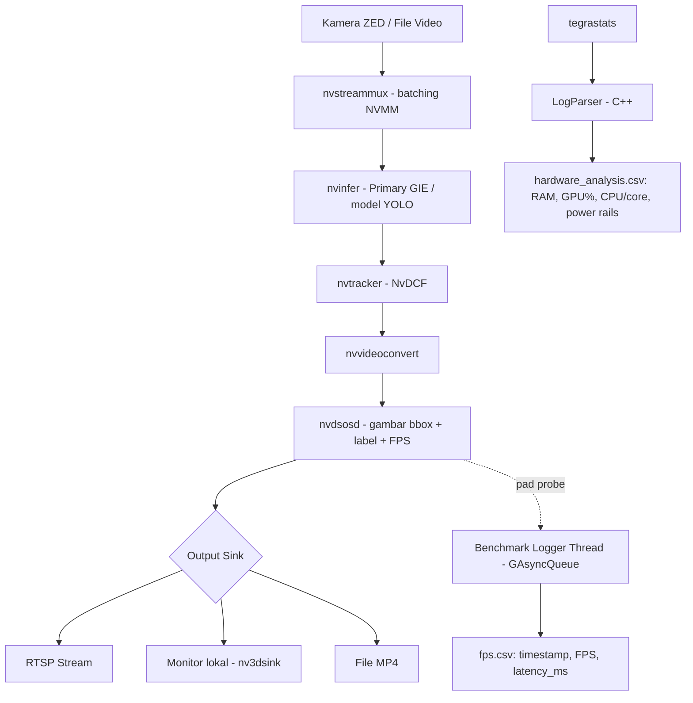

# 1. Scope & Arsitektur Sistem

## 1.1 Rumusan Batasan (Scope)

Proyek ini **hanya** membahas **perception layer** dari sebuah sistem ADAS, yaitu tahap
deteksi objek dari citra kamera. Ini adalah keputusan sadar untuk mempersempit topik skripsi
S1 agar bisa dieksekusi dan dievaluasi dengan mendalam dalam satu semester, dibanding mencoba
membangun seluruh sistem ADAS (persepsi + prediksi + planning + control).

**Termasuk dalam scope:**
- Deteksi objek 2D real-time (`car`, `van`, `truck`) dari stream kamera/video.
- Perbandingan beberapa varian model YOLO (nano/tiny-class) dari sisi **akurasi** dan
  **performa runtime** pada perangkat edge otomotif-kelas (Jetson Orin Nano).
- Object tracking ringan (NvDCF) untuk menjaga konsistensi ID antar frame.
- Analisis trade-off akurasi vs. kecepatan vs. konsumsi daya untuk merekomendasikan model
  yang paling sesuai untuk deployment.

**Tidak termasuk dalam scope** (dan harus dinyatakan secara eksplisit di skripsi supaya
tidak terlihat seperti kelalaian):
- Estimasi jarak/depth (walaupun kamera ZED adalah kamera stereo, pipeline saat ini hanya
  memakai stream 2D-nya — lihat [08_limitations_future_work.md](08_limitations_future_work.md)).
- Sensor fusion (radar/LiDAR/IMU).
- Path planning & control (steering, braking, dsb).
- Deteksi kondisi non-ideal (malam hari, hujan, kabut) — dataset KITTI didominasi kondisi
  siang hari dan cuaca cerah.

## 1.2 Arsitektur Sistem

Implementasi pipeline ada di `src/main.cpp` (class `DeepStreamApplication`), dan setiap tahap
di atas mengikuti urutan pemanggilan di `buildPipeline()` / `buildInput()` / `buildOutput()`.

## 1.3 Stack Perangkat Keras & Perangkat Lunak

| Komponen | Pilihan | Kategori |
|---|---|---|
| Compute board | NVIDIA Jetson Orin Nano | Edge AI, target deployment ADAS |
| Kamera | Stereolabs ZED (stereo, dipakai sebagai sumber 2D) | Sensor |
| Inference SDK | NVIDIA DeepStream 7.1 (GStreamer-based) | Runtime inference pipeline |
| Model | YOLOv8n, YOLOv9t, YOLOv10n, YOLO26n (fine-tuned KITTI) | Model deteksi objek |
| Precision | FP16 (TensorRT) | Kuantisasi/precision runtime |
| Bahasa aplikasi | C++17 (RAII, multithreaded) | Bahasa aplikasi utama |
| Tracker | NvMultiObjectTracker — profil NvDCF | Object tracking |
| Profiling hardware | `tegrastats` (bawaan Jetson) | Hardware/power profiling |
| Evaluasi akurasi | Ultralytics `YOLO.val()` (Python) | Accuracy/mAP evaluation |

## 1.4 Kenapa Pilih Ini, Bukan Itu? (Rasionalisasi Desain)

Bagian ini penting untuk Bab 3 (Metodologi) skripsi — setiap keputusan desain harus punya
alasan yang bisa dipertanggungjawabkan, bukan sekadar "karena tutorial pakai ini".

### Kenapa DeepStream, bukan OpenCV + TensorRT/ONNXRuntime manual?
DeepStream membangun pipeline inferensi di atas GStreamer dengan buffer **NVMM (NVIDIA Memory
Manager)** — artinya decode → inferensi → tracking → encode terjadi di memori GPU tanpa
banyak *copy* balik ke CPU (zero-copy). Untuk kebutuhan real-time pada SoC embedded, ini
jauh lebih efisien dibanding pipeline OpenCV manual yang biasanya bolak-balik CPU↔GPU untuk
setiap tahap (decode di CPU, preprocessing di CPU, lalu upload ke GPU untuk inferensi).
Argumen ini — bukan "karena rekomendasi NVIDIA" — yang harus ditulis di skripsi.

### Kenapa model kelas nano/tiny (v8n, v9t, v10n, v26n), bukan varian s/m/l?
Perception layer ADAS dibatasi oleh **anggaran komputasi dan daya** di perangkat edge, bukan
oleh ketersediaan akurasi tanpa batas. Varian nano/tiny secara sengaja didesain untuk
menukar sedikit akurasi demi throughput/latensi yang jauh lebih baik — ini titik desain yang
tepat untuk kasus penggunaan edge deployment. Membandingkan empat varian *nano-class* satu
sama lain (bukan nano vs. large) membuat perbandingan adil: compute budget kira-kira setara,
sehingga selisih hasil benar-benar mencerminkan perbedaan arsitektur antar generasi YOLO.

### Kenapa dataset KITTI, bukan COCO 80-kelas?
KITTI adalah benchmark standar untuk domain *autonomous driving* dengan kelas dan geometri
kamera yang relevan langsung ke kasus ADAS (mobil, van, truk dari sudut pandang kamera
kendaraan). COCO 80-kelas terlalu umum (termasuk kelas tidak relevan seperti "toaster" atau
"giraffe") dan tidak representatif untuk domain jalan raya. Model `yolov8n_coco` dalam
proyek ini dipertahankan hanya sebagai **baseline sanity-check umum**, bukan sebagai
kompetitor pada perbandingan utama.

### Kenapa precision FP16, bukan FP32 atau INT8?
- **FP32** tidak memanfaatkan penuh Tensor Core Jetson Orin Nano untuk keuntungan akurasi
  yang hampir tidak terasa dibanding FP16.
- **INT8** membutuhkan dataset kalibrasi tambahan dan biasanya kehilangan akurasi lebih
  banyak daripada FP16, dengan potensi kenaikan kecepatan yang tidak selalu proporsional.
- Jetson Orin Nano (berbeda dari Orin NX/AGX) **tidak memiliki DLA (Deep Learning
  Accelerator)** — jadi keuntungan INT8 khas DLA pada seri Orin lain tidak berlaku di sini;
  keuntungannya hanya dari GPU Ampere biasa, yang lebih kecil.
- Karena itu FP16 adalah *default* yang paling seimbang untuk SoC ini, dan dipakai konsisten
  di seluruh eksperimen supaya perbandingan antar model adil (precision bukan variabel bebas
  dalam eksperimen ini).

### Kenapa `tegrastats`, bukan `nvidia-smi` atau alat eksternal?
`nvidia-smi` tidak tersedia di Jetson (tidak memakai driver NVIDIA discrete GPU standar).
`tegrastats` adalah utilitas bawaan resmi Jetson dengan overhead sangat rendah dan mampu
membaca rail daya on-SoC langsung — tanpa perlu hardware tambahan (power meter/shunt
resistor) yang umumnya tidak tersedia untuk mahasiswa S1.

### Kenapa NvDCF tracker ditambahkan setelah deteksi?
Asosiasi ID antar frame mengurangi efek *flicker* (objek terdeteksi lalu hilang sesaat lalu
muncul lagi) akibat kegagalan deteksi sesaat — relevan untuk skenario ADAS di mana objek bisa
terhalang sebagian (*partial occlusion*) selama beberapa frame.

### Kenapa logger benchmark berjalan di thread terpisah (`GAsyncQueue`)?
Menulis file CSV secara langsung di dalam pad probe OSD (jalur kritis render setiap frame)
akan menambah I/O latency ke jalur yang sedang diukur — mengotori hasil pengukuran FPS/latensi
itu sendiri. Dengan memindahkan penulisan file ke thread terpisah lewat queue non-blocking,
proses pengukuran tidak mengganggu apa yang sedang diukur. Ini poin metodologis penting yang
sebaiknya ditulis eksplisit di Bab 3: *"harness benchmark didesain untuk tidak mengganggu
metrik yang diukur."*
