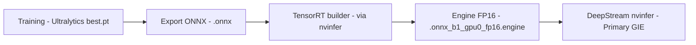

# 3. Deployment Pipeline

## 3.1 Jalur Ekspor Model



Setiap model memiliki 3 artefak yang konsisten di folder `models/`:

| Ekstensi | Isi | Dibuat oleh |
|---|---|---|
| `.pt` | Bobot PyTorch hasil training Ultralytics | Notebook training (Kaggle) |
| `.onnx` (+ `.onnx.data` jika ada) | Hasil ekspor `model.export(format="onnx")` | Notebook training/ekspor |
| `.onnx_b1_gpu0_fp16.engine` | TensorRT engine FP16, batch=1, gpu 0 | Otomatis dibuat oleh `nvinfer` DeepStream saat pertama kali dijalankan (build cache) |

> Catatan: file `.engine` bersifat spesifik-hardware dan spesifik-versi TensorRT — kalau
> proyek dipindah ke Jetson lain atau JetPack/TensorRT versi berbeda, file `.engine` harus
> dihapus supaya `nvinfer` membangun ulang dari `.onnx` (otomatis, tapi butuh waktu di run
> pertama).

## 3.2 Konfigurasi `nvinfer` per Model

Setiap model punya file konfigurasi sendiri di `config/pgie_<nama_model>.txt`, mengikuti
pola penamaan yang konsisten:

```
config/pgie_yolov8n_kitti.txt
config/pgie_yolov9t_kitti.txt
config/pgie_yolov10n_kitti.txt
config/pgie_yolov26n_kitti.txt
config/pgie_yolov8n_coco.txt      # baseline sanity-check, bukan pembanding utama
```

Pola ini secara sengaja dijaga konsisten (`pgie_<model>.txt`) karena
`scripts/run_benchmark.sh` (lihat [04_benchmark_protocol.md](04_benchmark_protocol.md))
menemukan model yang tersedia secara otomatis dengan mem-*parse* nama file ini. **Jika
menambah model baru, ikuti pola nama yang sama** agar otomatis terdeteksi oleh runner.

Parameter kunci yang **konsisten** di seluruh model KITTI (`num-detected-classes=3`,
`network-mode=2` untuk FP16, `nms-iou-threshold=0.45`, `pre-cluster-threshold=0.05`) sengaja
dijaga sama, supaya perbedaan hasil murni berasal dari perbedaan arsitektur/bobot model, bukan
dari perbedaan setting inferensi.

### Varian FP32 (opsional, bukan default)

Untuk setiap config KITTI di atas juga tersedia varian `_fp32` yang identik kecuali
precision-nya, dipakai untuk eksperimen pembanding FP16 vs FP32 (bukan menggantikan baseline
FP16):

```
config/pgie_yolov8n_kitti_fp32.txt
config/pgie_yolov9t_kitti_fp32.txt
config/pgie_yolov10n_kitti_fp32.txt
config/pgie_yolov26n_kitti_fp32.txt
config/pgie_yolov8n_coco_fp32.txt
config/pgie_yolov8n_kitti_efficientnms_fp32.txt
config/pgie_yolov9t_kitti_efficientnms_fp32.txt
```

Perbedaan config `_fp32` terhadap config FP16 aslinya hanya dua baris:

```diff
- model-engine-file=../models/<model>.onnx_b1_gpu0_fp16.engine
+ model-engine-file=../models/<model>.onnx_b1_gpu0_fp32.engine

- network-mode=2
+ network-mode=0
```

Engine `.engine` FP16 dan FP32 disimpan berdampingan di `models/` (nama file membedakan
precision), supaya cache engine tidak pernah saling tertukar antar precision. Engine standar
(non-EfficientNMS) dibangun otomatis oleh `nvinfer` pada run pertama; engine EfficientNMS
harus dibangun manual (lihat §3.5.1) karena ONNX baseline tidak memuat plugin NMS.

Karena `scripts/run_benchmark.sh` mem-*parse* nama file `pgie_*.txt` menjadi nama model,
varian ini otomatis muncul di `--list` sebagai model terpisah, misalnya `yolov8n_kitti_fp32`.
Jalankan dengan `--model yolov8n_kitti_fp32` untuk benchmark presisi FP32, terpisah dari hasil
FP16 `yolov8n_kitti`.

## 3.3 Tahapan Pipeline DeepStream (`src/main.cpp`)

| Tahap | Elemen GStreamer/DeepStream | Fungsi |
|---|---|---|
| Input | `zedsrc` (ZED) atau `uridecodebin` (file) | Sumber video, dinormalisasi ke NV12 di NVMM |
| Batching | `nvstreammux` | Menggabungkan stream jadi satu batch (batch-size=1) |
| Inferensi | `nvinfer` | Primary GIE — menjalankan model YOLO via TensorRT |
| Tracking | `nvtracker` (profil YAML dinamis) | Menjaga ID objek antar frame; profil dipilih melalui `--tracker <nama|path>` |
| Render | `nvdsosd` | Menggambar bounding box, label, dan teks FPS |
| Output | `nvv4l2h264enc`/`x264enc` → RTSP / `nv3dsink` / `filesink` (mp4) | Menyalurkan hasil |
| *(paralel)* Benchmark | Pad probe di sink OSD → `GAsyncQueue` → thread logger | Mencatat FPS + latensi ke CSV tanpa mengganggu pipeline |

## 3.4 Caveat Akurasi: FP32 (training) vs FP16 (deployment)

Nilai mAP/Precision/Recall di [05_accuracy_results.md](05_accuracy_results.md) diukur dari
bobot **`.pt` (FP32)** menggunakan `model.val()` di GPU cloud (Tesla T4, Kaggle) — **bukan**
dari engine TensorRT FP16 yang benar-benar berjalan di Jetson lewat DeepStream.

Secara umum, penurunan akurasi akibat kuantisasi FP16 untuk model YOLO biasanya kecil
(umumnya < 1 poin mAP), sehingga angka mAP dari `.pt` FP32 **cukup layak dipakai sebagai
proxy akurasi model FP16** dengan catatan/disclaimer eksplisit di skripsi. Kalimat yang
disarankan untuk Bab 4 (Hasil):

> *"Akurasi dievaluasi pada bobot FP32 (`.pt`); akurasi deployment FP16 diasumsikan setara
> dalam toleransi kuantisasi yang umum diamati pada model YOLO, namun tidak diverifikasi
> secara independen pada proyek ini."*

Jika ingin memverifikasi langsung (opsional, bukan wajib untuk skripsi S1, tapi bagus untuk
poin tambahan), langkah yang diperlukan:
1. Jalankan pipeline DeepStream pada 1010 gambar val (sebagai file video/urutan gambar).
2. Dump `NvDsObjectMeta` (kelas + bbox + confidence) per frame ke file JSON/txt.
3. Cocokkan dengan ground-truth label KITTI menggunakan IoU matcher sederhana (atau
   `pycocotools`) untuk menghitung mAP versi "as-deployed".

### 3.5.1 Membangun Engine EfficientNMS (FP16 & FP32)

`utils/trt_efficientnms/build_efficientnms_engine.py` mendukung flag `--fp16` (default) dan
`--fp32`. Wrapper `scripts/build_efficientnms_engines.sh` menjalankan script ini untuk kedua
model (`yolov8n_kitti`, `yolov9t_kitti`) dan kedua precision, sambil **melewati (skip) build
jika file `.engine` tujuan sudah ada** — aman dijalankan berulang kali tanpa membangun ulang
engine yang sudah tersedia:

```bash
# Lihat status tiap kombinasi model/precision tanpa membangun apa pun
./scripts/build_efficientnms_engines.sh --list

# Build seluruh kombinasi (fp16+fp32) yang belum ada; yang sudah ada otomatis dilewati
./scripts/build_efficientnms_engines.sh

# Hanya satu model, kedua precision
./scripts/build_efficientnms_engines.sh --model yolov8n_kitti

# Hanya precision fp32, semua model
./scripts/build_efficientnms_engines.sh --precision fp32

# Paksa membangun ulang walau file engine sudah ada (menimpa)
./scripts/build_efficientnms_engines.sh --force
```

Penamaan output mengikuti `model-engine-file` di `config/pgie_*_efficientnms*.txt`:

```text
models/yolov8n_kitti_efficientnms.engine        # FP16 (baseline)
models/yolov8n_kitti_efficientnms_fp32.engine   # FP32 (pembanding)
models/yolov9t_kitti_efficientnms.engine        # FP16 (baseline)
models/yolov9t_kitti_efficientnms_fp32.engine   # FP32 (pembanding)
```

Script ini harus dijalankan di Jetson (butuh TensorRT + Python bindings + GPU), tidak bisa di
lingkungan pengembangan biasa. ONNX sumber di `models/` tidak pernah diubah.

## 3.5 Item Verifikasi Khusus YOLO26n

Karena YOLO26 memakai head NMS-free + tanpa DFL (lihat
[02_dataset_and_training.md](02_dataset_and_training.md)), sebelum mempercayai hasil
deployment `yolov26n_kitti` secara penuh, sebaiknya dicek:
- Apakah `NvDsInferParseYolo` (custom parser di `lib/libnvdsinfer_custom_impl_Yolo.so`)
  memang dites/dikonfirmasi kompatibel dengan format output ONNX YOLO26, atau parser ini
  awalnya ditulis untuk format output v8-style saja.
- Bandingkan visual hasil bounding box `yolov26n_kitti` di monitor/RTSP dengan model lain —
  jika box terlihat normal (tidak dobel/tidak meleset), itu indikasi kuat parser bekerja
  benar untuk model ini juga.
