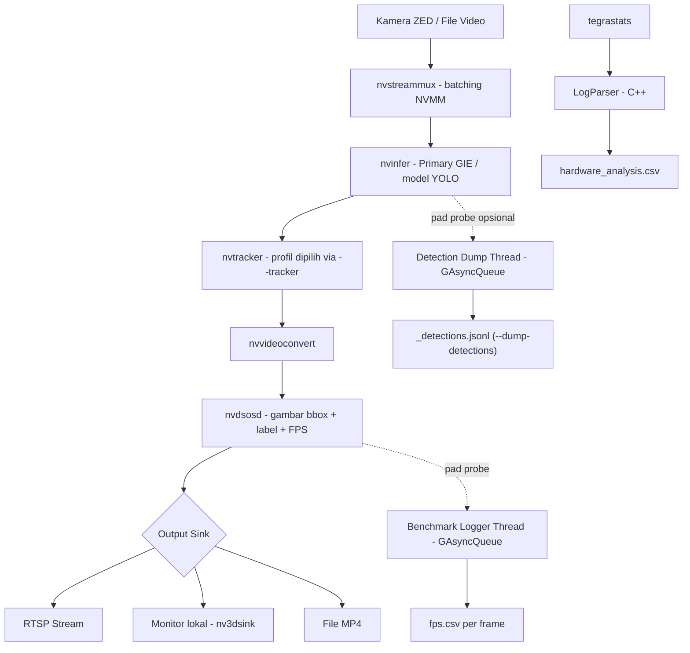

# BAB III — METODOLOGI PENELITIAN

> Status: draf pertama (2026-08-14). Digrounding langsung ke implementasi teknis nyata di
> `../../docs/01-08`, `../../scripts/`, `../../config/`, `../../CMakeLists.txt`, dan
> `../../utils/eval_map/` — bukan generalisasi buku teks metodologi penelitian. Field bertanda
> `[VERIFIKASI]` masih perlu dicek/diisi manual oleh penulis sebelum dianggap final.

## 3.1 Jenis dan Pendekatan Penelitian

Penelitian ini merupakan penelitian **eksperimental kuantitatif** yang membandingkan kinerja
konfigurasi *pipeline* deteksi-dan-*tracking* objek secara berpasangan (*baseline* vs.
*optimized*) pada instrumen dan kondisi pengujian yang dikontrol seketat mungkin — perangkat
keras yang sama (Jetson Orin Nano), video input yang sama, mode daya yang sama
(`nvpmodel -m 0` + `jetson_clocks`), dan harness pengukuran yang sama untuk seluruh skenario.
Pendekatan ini dipilih karena ketiga rumusan masalah (§1.2) pada dasarnya menanyakan **efek
dari mengganti satu komponen *pipeline*** terhadap kinerja *real-time*, sehingga desain
perbandingan terkontrol (bukan survei atau studi kualitatif) adalah yang paling sesuai.

Penelitian memiliki tiga sumbu eksperimen independen, masing-masing menjawab satu rumusan
masalah:

1. **Karakterisasi *baseline*** (RM1) — mengukur kinerja *pipeline* Nvidia DeepStream apa
   adanya (tanpa optimasi tambahan) untuk keempat model deteksi (YOLOv8n, YOLOv9t, YOLOv10n,
   YOLO26n) pada Jetson Orin Nano.
2. ***Post-processing* NMS: standar vs. paralel** (RM2) — membandingkan NMS bawaan `nvinfer`
   dengan NMS paralel berbasis TensorRT plugin (`EfficientNMS_TRT`) pada model yang mendukung
   keduanya (YOLOv8n, YOLOv9t), mengukur dampaknya terhadap FPS dan latensi.
3. ***Tracking*: NvDCF vs. NvSORT** (RM3) — membandingkan efisiensi komputasi
   dua profil *tracker* DeepStream pada keenam konfigurasi model, **dibatasi pada aspek
   efisiensi komputasi saja** (lihat batasan §1.5 poin 5 dan argumentasi Bab II §2.2.6 —
   evaluasi kualitas *tracking* seperti *ID switch*/MOTA/IDF1 secara eksplisit di luar *scope*).

Karena model yang dipakai adalah model *pre-trained* (bukan dilatih ulang dalam penelitian
ini — lihat batasan §1.5 poin 3), akurasi deteksi bukan variabel yang dioptimasi; akurasi
hanya diperiksa sebagai *sanity check* pendukung ("apakah kinerja *real-time* diperoleh tanpa
mengorbankan akurasi secara tersembunyi") — lihat §3.5 poin 4.

## 3.2 Alat dan Bahan

### 3.2.1 Perangkat Keras

| Komponen | Spesifikasi |
|---|---|
| *Compute board* | NVIDIA Jetson Orin Nano — `[VERIFIKASI]` spesifikasi resmi (varian SKU 4GB/8GB, jumlah CUDA core, kapasitas TOPS, mode daya yang dipakai) sengaja **tidak** diisi di sini; akan diisi manual oleh penulis sesuai keputusan sesi 2026-08-14 (lihat `../log/log-perubahan.md`). |
| Kamera | Stereolabs ZED (stereo), dipakai hanya sebagai sumber *stream* 2D — lihat batasan §1.5 dan limitasi `../../docs/08_limitations_future_work.md` poin 1. Didukung pada FPS 15/30/60/100/120 (`--camera-fps`, default konfigurasi benchmark: 30 FPS). |

### 3.2.2 Perangkat Lunak

| Komponen | Versi/Detail |
|---|---|
| Inference SDK | NVIDIA DeepStream 7.1 (berbasis GStreamer) — `../../docs/01_scope_and_architecture.md` §1.3 |
| Precision runtime | FP16 (TensorRT), rasionalisasi pemilihan di §3.4 |
| Bahasa aplikasi utama | C++17 (`CMAKE_CXX_STANDARD 17`, `CMakeLists.txt:4-5`), dibangun dengan CMake ≥3.10 |
| Library inti | GStreamer 1.0, GLib 2.0, `nvdsgst_meta`/`nds_meta` (DeepStream metadata API) — `CMakeLists.txt:24-35` |
| Parser custom | `nvdsinfer_custom_impl_EfficientNMS` (`src/efficientnms_parser.cpp`, `CMakeLists.txt:41-66`), memerlukan CUDA Toolkit (dicari otomatis via `cuda_runtime_api.h`) |
| Evaluasi akurasi (proxy FP32) | Ultralytics `YOLO.val()` (Python, Kaggle GPU Tesla T4) |
| Evaluasi akurasi (as-deployed FP16) | `pycocotools.cocoeval.COCOeval` — lihat §3.5 poin 4 |
| Profiling hardware | `tegrastats` (bawaan Jetson Linux) |

> `[VERIFIKASI]` Versi persis GStreamer/GLib/CUDA Toolkit yang terpasang di perangkat pengujian
> tidak dipin secara eksplisit di `CMakeLists.txt` (memakai versi sistem via `pkg_check_modules`
> dan pencarian header CUDA otomatis). Penulis perlu mencatat versi aktual (mis. lewat
> `gst-inspect-1.0 --version`, `nvcc --version`, `dpkg -l | grep -E "cuda|gstreamer"`) sebagai
> bagian dari metadata reproducibility, karena versi ini biasanya sudah ditentukan oleh image
> JetPack yang terpasang di perangkat, bukan dipilih bebas oleh penulis.

### 3.2.3 Dataset

Dataset KITTI dengan pemetaan ulang 3 kelas kustom (`0=car`, `1=van`, `2=truck`, lihat
`labels/labels_kitti_custom.txt`). *Split* validasi: **1.010 gambar, 4.722 instance**
(car 4.167, van 405, truck 150) — identik untuk seluruh model, sehingga hasil akurasi antar
model dapat dibandingkan langsung (`../../docs/02_dataset_and_training.md`,
`../../docs/05_accuracy_results.md`). Ketimpangan kelas (`van`/`truck` jauh lebih sedikit dari
`car`) dicatat sebagai limitasi statistik saat membahas hasil per-kelas
(`../../docs/08_limitations_future_work.md` poin 3).

> `[VERIFIKASI]` Hyperparameter pelatihan (rasio split, *seed*, jumlah epoch, ukuran batch,
> optimizer, augmentasi, sumber bobot *pretrained*) belum diisi di `../../docs/02_*` (tabel
> TODO) — perlu diambil dari `args.yaml` Kaggle notebook penulis, bukan ditebak. Item ini di
> luar cakupan langsung Bab III (karena penelitian ini **tidak** melatih ulang model, lihat
> batasan §1.5 poin 3), tapi tetap relevan sebagai metadata sumber model *pre-trained* yang
> dipakai.

### 3.2.4 Model Deteksi

| Model | Params | GFLOPs | Konfigurasi NMS | File config |
|---|---|---|---|---|
| YOLOv8n | 3.006.233 | 8,1 | NMS bawaan `nvinfer` (*baseline*) | `config/pgie_yolov8n_kitti.txt` |
| YOLOv9t | 1.971.369 | 7,6 | NMS bawaan `nvinfer` (*baseline*) | `config/pgie_yolov9t_kitti.txt` |
| YOLOv10n | 2.265.753 | 6,5 | NMS-*free* (arsitektural) | `config/pgie_yolov10n_kitti.txt` |
| YOLO26n | 2.375.421 | 5,2 | NMS-*free* (arsitektural) | `config/pgie_yolov26n_kitti.txt` |
| YOLOv8n + EfficientNMS | 3.006.233 | 8,1 | NMS paralel (`EfficientNMS_TRT`) | `config/pgie_yolov8n_kitti_efficientnms.txt` |
| YOLOv9t + EfficientNMS | 1.971.369 | 7,6 | NMS paralel (`EfficientNMS_TRT`) | `config/pgie_yolov9t_kitti_efficientnms.txt` |

Total 6 konfigurasi model di atas menjadi dasar 12 skenario RM3 (6 model × 2 *tracker*, §3.5
poin 3). Perbandingan RM2 (NMS standar vs. paralel) hanya berlaku pada pasangan YOLOv8n/YOLOv9t
(model dengan varian *baseline* dan EfficientNMS yang setara) — YOLOv10n dan YOLO26n tidak
disertakan pada perbandingan RM2 karena keduanya sudah NMS-*free* secara arsitektural, sehingga
tidak ada pasangan pembanding yang setara.

Satu model tambahan, **YOLOv8n-COCO** (80 kelas, `config/pgie_yolov8n_coco.txt`), dipertahankan
hanya sebagai *sanity-check* umum kebenaran *pipeline* (mis. memverifikasi *parser*/rendering
berjalan benar di luar domain KITTI) — **bukan** kompetitor pada perbandingan akurasi/efisiensi
utama (`../../docs/01_scope_and_architecture.md` §1.4).

### 3.2.5 Konfigurasi Tracker

| Tracker | File config | Karakteristik singkat (detail: Bab II §2.2.6) |
|---|---|---|
| NvDCF | `config/tracker_nvdcf.yml` | *Feature-based*, pemrosesan piksel penuh, akurasi/robustness tertinggi |
| NvSORT | `config/tracker_nvsort.yml` | *Motion-only* (Kalman filter + Hungarian algorithm), tanpa pemrosesan piksel, paling ringan |

### 3.2.6 Tooling Otomasi Pengujian

- `scripts/build.sh` — kompilasi aplikasi C++ (`app`, `parser`/`src/log_parser.cpp`, library
  `nvdsinfer_custom_impl_EfficientNMS`).
- `scripts/run_benchmark.sh` — *harness* satu-*run*: menjalankan `app` dengan `--benchmark`
  (menulis `fps.csv` per-frame), merekam `tegrastats` konkuren (diproses jadi
  `hardware_analysis.csv`), dan mencatat metadata *run* ke `run_info.txt` (model, config,
  tracker, mode input/output, durasi, `git_commit`, mode `nvpmodel`, status `jetson_clocks`,
  timestamp mulai/selesai). Setiap *run* tersimpan di folder unik bertimestamp
  (`data/benchmark/<model>/<timestamp>/`) — **tidak pernah** menimpa hasil *run* sebelumnya.
- `scripts/run_all_benchmark.sh` — orkestrasi otomatis 12 skenario (6 model × 2 *tracker*)
  secara berurutan: memaksa `nvpmodel -m 0` + `jetson_clocks` di awal, menjalankan tiap skenario
  lewat `run_benchmark.sh`, lalu jeda *cooldown* 60 detik + pembersihan cache (`sync` +
  `drop_caches`) antar skenario untuk stabilisasi termal.
- `scripts/prepare_eval_video.sh` dan `utils/eval_map/eval_deepstream_map.py` — infrastruktur
  pendukung verifikasi akurasi *as-deployed* FP16 (lihat status implementasi di §3.5 poin 4).

## 3.3 Tahapan Penelitian

1. **Persiapan lingkungan** — *build* aplikasi (`scripts/build.sh`); verifikasi *engine*
   TensorRT (`.onnx_b1_gpu0_fp16.engine`) berhasil dibangun otomatis oleh `nvinfer` pada
   eksekusi pertama tiap model (spesifik perangkat/versi TensorRT — dihapus ulang bila
   berpindah perangkat).
2. **Definisi kriteria *real-time*** (§3.6) — ditetapkan sebelum pengujian dimulai, supaya
   analisis hasil (Bab IV) tidak menyesuaikan ambang batas setelah melihat data.
3. **Pengukuran *baseline* (RM1)** — jalankan `scripts/run_benchmark.sh` untuk keempat model
   *baseline* (YOLOv8n, YOLOv9t, YOLOv10n, YOLO26n) dengan *tracker default* (NvDCF), video
   input tetap (`data/input/video_testing.mp4`), ukur FPS dan latensi per-komponen dari
   `fps.csv`.
4. **Pengukuran optimasi NMS paralel (RM2)** — jalankan `scripts/run_benchmark.sh` untuk varian
   EfficientNMS (YOLOv8n, YOLOv9t), bandingkan terhadap hasil langkah 3 pada pasangan model
   yang sama (kondisi lain tetap identik).
5. **Verifikasi akurasi *as-deployed* FP16** (pendukung, lihat status §3.5 poin 4) — dump
   deteksi mentah `NvDsObjectMeta` per model via `--dump-detections`, hitung mAP dengan
   `utils/eval_map/eval_deepstream_map.py`, bandingkan terhadap proxy FP32
   (`../../docs/05_accuracy_results.md`).
6. **Pengukuran efisiensi komputasi *tracking* (RM3)** — jalankan
   `scripts/run_all_benchmark.sh` (12 skenario penuh: 6 model × 2 *tracker*), kumpulkan
   `fps.csv` dan `hardware_analysis.csv` tiap skenario.
7. **Analisis dan perbandingan** — agregasi seluruh hasil (baseline, NMS, tracker, akurasi
   pendukung) terhadap kriteria evaluasi (§3.6), disusun jadi tabel/grafik untuk Bab IV.

Sesuai rekomendasi protokol benchmark (`../../docs/04_benchmark_protocol.md`), setiap skenario
sebaiknya diulang 3–5 repetisi dengan jeda 30–60 detik antar repetisi (stabilisasi termal), dan
10–15 detik awal tiap *run* (*warm-up*) dibuang saat analisis.

> `[VERIFIKASI]` Jumlah repetisi aktual yang benar-benar dijalankan penulis di perangkat
> (bukan sekadar rekomendasi protokol) perlu dicatat di sini setelah pengujian selesai.

## 3.4 Arsitektur/Desain Pipeline

Implementasi ada di `src/main.cpp` (kelas `DeepStreamApplication`), mengikuti urutan pemanggilan
`buildPipeline()`/`buildInput()`/`buildOutput()`. Beberapa keputusan desain yang relevan sebagai
justifikasi metodologis (bukan sekadar "mengikuti tutorial"):

- **DeepStream vs. OpenCV+TensorRT manual**: buffer NVMM membuat decode → inferensi →
  *tracking* → *encode* berjalan di memori GPU tanpa *copy* bolak-balik ke CPU (*zero-copy*),
  lebih efisien untuk kebutuhan *real-time* pada SoC *embedded* dibanding pipeline OpenCV
  manual yang biasanya bolak-balik CPU↔GPU tiap tahap.
- **Model kelas nano/tiny, bukan varian s/m/l**: *perception layer* ADAS dibatasi anggaran
  komputasi dan daya perangkat *edge*. Membandingkan empat varian *nano-class* satu sama lain
  (bukan nano vs. *large*) membuat perbandingan adil — *compute budget* kira-kira setara,
  sehingga selisih hasil mencerminkan perbedaan arsitektur antar generasi YOLO, bukan sekadar
  perbedaan skala model.
- **Precision FP16, bukan FP32/INT8**: FP32 tidak memanfaatkan penuh Tensor Core untuk
  keuntungan akurasi yang hampir tidak terasa; INT8 butuh dataset kalibrasi tambahan dan
  Jetson Orin Nano (berbeda dari Orin NX/AGX) **tidak memiliki DLA**, sehingga keuntungan INT8
  khas DLA tidak berlaku di sini. FP16 dipakai konsisten di seluruh eksperimen — presisi bukan
  variabel bebas dalam penelitian ini.
- **`tegrastats`, bukan `nvidia-smi`**: `nvidia-smi` tidak tersedia di Jetson (arsitektur driver
  berbeda); `tegrastats` adalah utilitas bawaan resmi dengan *overhead* rendah dan mampu membaca
  rail daya on-SoC langsung tanpa perangkat tambahan.
- **Logger benchmark berjalan di thread terpisah (`GAsyncQueue`)**: menulis CSV langsung di
  dalam *pad probe* (jalur kritis render tiap frame) akan menambah *I/O latency* ke jalur yang
  sedang diukur. Dengan memindahkan penulisan ke *thread* terpisah lewat *queue non-blocking*,
  proses pengukuran didesain untuk **tidak mengganggu metrik yang diukur** — prinsip yang sama
  dipakai pada probe dump deteksi (`--dump-detections`, §3.5 poin 4).

Detail lengkap ada di `../../docs/01_scope_and_architecture.md` §1.2 dan §1.4.

## 3.5 Skenario Pengujian

1. **Baseline *pipeline* (RM1)** — empat model (YOLOv8n, YOLOv9t, YOLOv10n, YOLO26n), *tracker*
   *default* NvDCF, video input tetap, ukur FPS keseluruhan dan latensi per-komponen
   (`Lat_PreMux_ms`, `Lat_Mux_ms`, `Lat_Infer_ms`, `Lat_Tracker_ms`, `Lat_PreOSD_ms`,
   `Lat_OSD_ms`, `Lat_Output_ms` dari `fps.csv`).
2. **NMS standar vs. NMS paralel EfficientNMS (RM2)** — pasangan YOLOv8n/YOLOv9t *baseline* vs.
   varian EfficientNMS, kondisi lain identik terhadap skenario 1. Fokus perbandingan pada
   `Lat_Infer_ms` (tahap yang mencakup *post-processing* NMS) dan FPS keseluruhan.
3. **Efisiensi komputasi *tracking* (RM3)** — jalankan `scripts/run_all_benchmark.sh` untuk 12
   skenario (6 model × 2 konfigurasi *tracker*: NvDCF/NvSORT). Bandingkan
   `Lat_Tracker_ms` (median & p95) dan `hardware_analysis.csv` (GPU%, CPU/*core*, RAM, daya)
   antar konfigurasi *tracker*. **Tidak** mengukur kualitas/akurasi *tracking* (*ID switch*,
   MOTA/IDF1) — lihat batasan §1.5 poin 5 dan argumentasi Bab II §2.2.6.
4. **Verifikasi akurasi *as-deployed* FP16 (pendukung, bukan bagian dari rumusan masalah inti)**
   — mengukur mAP langsung dari keluaran `NvDsObjectMeta` pipeline DeepStream FP16 pada 1.010
   gambar val KITTI yang sama, dibandingkan terhadap proxy FP32
   (`../../docs/05_accuracy_results.md`), untuk memastikan tidak ada penurunan akurasi
   tersembunyi akibat kuantisasi/*parsing* custom (`../../docs/03_deployment_pipeline.md` §3.4).

   **Status implementasi (per 2026-08-14)**: infrastrukturnya **sudah selesai diimplementasikan
   di kode** (`git log` — komit "feat: add as-deployed detection dump for FP16 verification"):
   - `--dump-detections <path>` (flag CLI baru di `src/main.cpp`, pola sama seperti
     `--benchmark`) — probe di *src pad* `primary-inference` mendump `NvDsObjectMeta` mentah
     (kelas, *bounding box*, *confidence*) per *frame* ke JSON Lines lewat *thread* async
     terpisah (pola sama seperti logger benchmark, lihat §3.4).
   - `scripts/prepare_eval_video.sh` — mengubah folder gambar val menjadi satu video lossless
     (`ffmpeg`, `-crf 0`) + `manifest.csv` (pemetaan *frame index* → nama file → resolusi
     asli), supaya bisa diputar lewat `--input file` yang sudah ada tanpa perlu membangun
     dukungan *image-sequence* baru di pipeline C++.
   - `utils/eval_map/eval_deepstream_map.py` — mengkonversi `manifest.csv` + hasil dump JSON
     Lines menjadi format COCO-*results*, *rescale bbox* dari kanvas `nvstreammux` (1280×720)
     balik ke resolusi gambar asli per *frame*, lalu menghitung mAP dengan
     `pycocotools.cocoeval.COCOeval` (keseluruhan dan per kelas).

   **Yang belum dilakukan**: (a) ekspor 1.010 gambar val + label dari notebook Kaggle ke
   perangkat lokal/Jetson (`data/eval/kitti_val/{images/,labels/}`) — perlu memastikan split
   yang diekspor **identik** dengan split yang menghasilkan angka Bab 5 (cek *seed*/`args.yaml`
   di notebook, supaya perbandingan FP16 vs FP32 *apple-to-apple*); (b) eksekusi nyata di Jetson
   untuk keempat model; (c) verifikasi visual *sanity-check* hasil *rescale bbox* sebelum
   angka mAP dipercaya; (d) update `../../docs/05_accuracy_results.md` §5.6 dan
   `../../docs/08_limitations_future_work.md` dengan hasil aktual. Karena statusnya
   infrastruktur-siap-tapi-belum-dieksekusi, skenario ini ditulis di sini sebagai **rencana
   pengujian pendukung**, bukan hasil yang sudah ada — hasil aktualnya baru bisa masuk Bab IV
   setelah langkah (a)-(d) selesai.

## 3.6 Kriteria Evaluasi

| Sumbu | Metrik | Kriteria |
|---|---|---|
| RM1 (*baseline*) | FPS keseluruhan | *Real-time* didefinisikan sebagai **throughput ≥ 30 FPS** (mengikuti konfigurasi default kamera ZED pada `scripts/run_benchmark.sh` dan standar ADAS *safety-critical* perception layer) |
| RM1 (*baseline*) | Latensi *end-to-end* | Dilaporkan sebagai persentil **p95/p99**, bukan hanya rata-rata — supaya *outlier*/*jitter* (relevan untuk *safety-critical*, lihat Bab I §1.1 ¶5) tidak tersembunyi di balik rata-rata |
| RM2 (NMS) | FPS & `Lat_Infer_ms` | Selisih (Δ) *baseline* vs. EfficientNMS pada pasangan model yang sama; peningkatan dianggap bermakna jika Δ konsisten di seluruh repetisi (bukan kebetulan *noise* satu *run*) |
| RM3 (*tracker*) | FPS keseluruhan, `Lat_Tracker_ms` (median & p95), GPU%/CPU%/RAM/daya | **Murni efisiensi komputasi** — sesuai batasan §1.5 poin 5. **Tidak** ada ambang akurasi *tracking* (*ID switch*, MOTA/IDF1) yang perlu dipenuhi; ini konsisten dengan pendekatan MLPerf Mobile Inference Benchmark yang menjadikan akurasi ambang kelulusan tetap (bukan variabel dibandingkan) — lihat Bab II §2.2.6 |
| Akurasi (pendukung, §3.5 poin 4) | mAP50, mAP50-95 (as-deployed FP16 vs. proxy FP32) | Bukan variabel dibandingkan antar model, melainkan **kriteria sanity-check pass/fail**: selisih diharapkan kecil (`[VERIFIKASI]` ambang pasti, mis. <1–2 poin, ditentukan penulis berdasarkan referensi literatur umum FP16-vs-FP32 setelah data aktual tersedia) |

> Ambang FPS target **dikunci ke 30 FPS** (bukan 15 FPS) berdasarkan: (a) default `CAMERA_FPS=30` pada `scripts/run_benchmark.sh`; (b) kemampuan kamera ZED 30 FPS HD untuk ADAS; (c) standar *safety-critical* perception layer yang menuntut margin lebih ketat. Kriteria ini ditetapkan *sebelum* pengujian untuk menghindari *p-hacking*.
