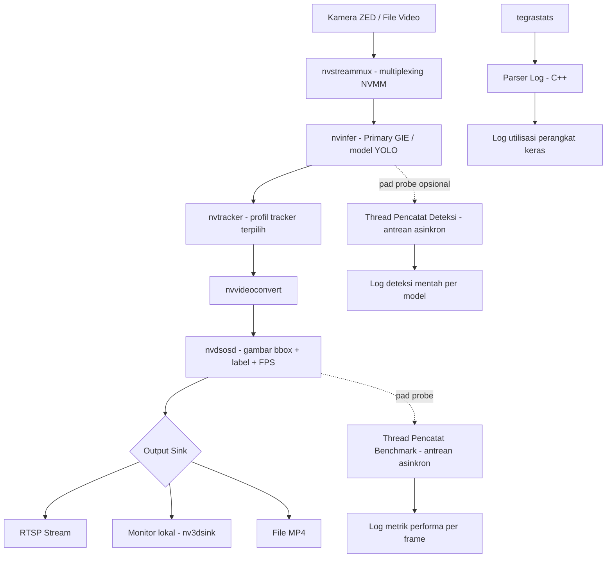
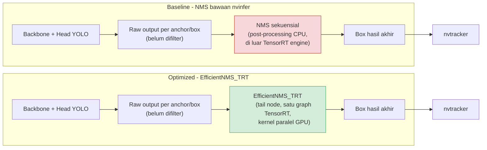
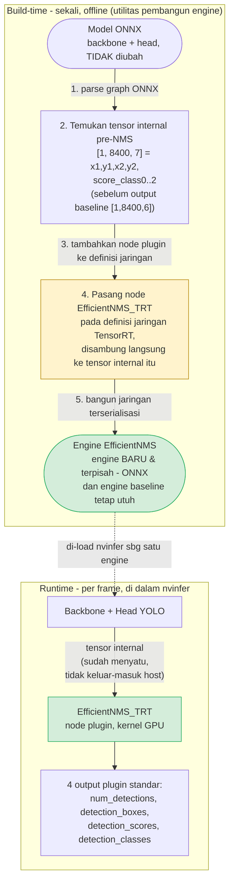

# BAB II METODE PENELITIAN

## 2.1 Tempat dan Waktu Penelitian

Penelitian serta pengujian optimasi model inferensi dilaksanakan di Departemen Teknik
Informatika, Universitas Hasanuddin. Keseluruhan tahapan penelitian, mulai dari
persiapan lingkungan sistem, kompilasi *pipeline*, hingga pengambilan data performa
perangkat eksekusi, dilakukan pada rentang waktu **Mei 2026 hingga Agustus 2026**.

nama laboratorium spesifik (mis. Laboratorium Jaringan dan Visi Komputer)
belum disebutkan eksplisit baik di PDF maupun dokumen proyek ini. Hal ini perlu
dikonfirmasi penulis bila diminta pembimbing/penguji.

Eksekusi eksperimen inti (pengujian *runtime*/*hardware* pada Jetson Orin Nano, 60 *run*)
secara spesifik tercatat berlangsung pada **19 Agustus 2026**, pukul 11:33–12:46 WITA
(± 72 menit, termasuk *cooldown* antar-*run*), sebagaimana tercatat pada metadata setiap
*run* pengujian (lihat rincian kondisi eksekusi di Bab III). Tanggal ini berada di
dalam rentang Mei–Agustus 2026 di atas, sebagai bagian akhir dari tahapan penelitian.

## 2.2 Instrumen Penelitian

Instrumen yang digunakan dalam penelitian ini adalah sebagai berikut:

1. **Perangkat lunak**
   a. Sistem Operasi Arch Linux 64-bit
   b. Sistem Operasi Windows 11 64-bit
   c. Sistem Operasi L4T (*Linux for Tegra* / Ubuntu Linux)
   d. *Notebook* Kaggle GPU NVIDIA Tesla P100
   e. Zed Editor
   f. GitHub
   g. Zen Web Browser
   h. Microsoft Office 365
   i. Canva
   j. Lucidchart
   k. Mendeley Reference Manager
   l. NVIDIA JetPack
   m. NVIDIA DeepStream SDK
   n. NVIDIA TensorRT
   o. NVIDIA Nsight Systems
2. **Perangkat keras**
   a. Laptop Advan WorkPlus, AMD Ryzen 5 6600H dengan Radeon Graphics (3,30 GHz), RAM
      16GB, SSD 512GB
   b. NVIDIA Jetson Orin Nano Super 4GB, GPU Ampere, 512 CUDA core, 16 Tensor core
      (generasi ke-3), hingga 625 MHz
3. **Bahasa Pemrograman**
   a. C++
   b. Python v3
   c. Bash
4. **Library Backend**
   a. Ultralytics (YOLO) oleh Tim Ultralytics: digunakan untuk deteksi objek pada
      *frame* video.
   b. NumPy oleh Travis Oliphant: digunakan untuk komputasi numerik dan manipulasi
      *array*.
   c. Pillow: digunakan untuk menyimpan *snapshot frame* dan manipulasi gambar.

**Rincian teknis perangkat Jetson Orin Nano.** Identifikasi SKU dan mode daya perangkat
butir 2b di atas didasarkan pada mode daya maksimum yang terbaca melalui utilitas
pengaturan daya bawaan Jetson Linux (*nvpmodel*) pada perangkat, yaitu **10W**. Nilai
ini unik untuk SKU **4GB** pada *firmware* standar (non-*Super clock mode*): modul 8GB
pada *firmware* yang sama hanya memiliki mode 7W/15W (tidak ada mode 10W), sesuai tabel
*Operating Requirements* pada *datasheet* resmi NVIDIA (NVIDIA, 2024). Karena mode
maksimum yang terbaca adalah 10W (bukan 25W), perangkat dipastikan berjalan pada
konfigurasi daya **default** (7W/10W), bukan mode performa maksimal *Super Clock*
(JetPack 6.2+), sehingga performa GPU/CPU yang menjadi acuan Bab III mencerminkan batas
atas mode *default* tersebut (hingga 625 MHz, sesuai butir 2b), bukan performa puncak
SoC (hingga 1020 MHz). Identifikasi ini diturunkan dari pembacaan
utilitas *nvpmodel*, bukan inspeksi label fisik modul. Penulis disarankan
mengonfirmasi ulang melalui pembacaan berkas identitas perangkat pada *device tree*
sistem saat perangkat kembali tersedia, sebagai verifikasi independen.

**Tabel 2.1** Spesifikasi Jetson Orin Nano 4GB (NVIDIA, 2024)

| Komponen | Mode *default* (7W/10W, dipakai penelitian ini) | Mode performa maksimal *Super Clock* (tidak dipakai) |
|---|---|---|
| GPU | Ampere, 512 CUDA core, 16 Tensor core (generasi ke-3), hingga 625 MHz | hingga 1020 MHz |
| Performa AI (INT8) | 10 TOPS (*dense*) / 20 TOPS (*sparse*) | 17 TOPS (*dense*) / 34 TOPS (*sparse*) |
| CPU | 6-core Arm Cortex-A78AE (2 klaster: 4-core + 2-core), *system cache* 4MB, hingga 1,5 GHz/core | hingga 1,7 GHz/core |
| Memori | 4GB LPDDR5, bus 64-bit, *bandwidth* hingga 34 GB/s | hingga 51 GB/s |
| Mode daya tersedia | 7W / 10W / 25W (*Super Clock*) | tidak tersedia |
| DLA | Tidak tersedia | Tidak tersedia |

Sumber: NVIDIA (2024), tabel "AI Performance", "GPU Operation" (Tabel 2-1), "CPU Cluster",
"Memory Subsystem", dan "Operating Requirements". Berbeda dari varian Jetson Orin NX dan
Jetson AGX Orin, Jetson Orin Nano **tidak dilengkapi Deep Learning Accelerator (DLA)**,
sehingga strategi optimasi yang bergantung pada DLA (seperti pada proposal awal
penelitian ini yang menargetkan Jetson AGX Orin) tidak dapat diterapkan pada perangkat
ini (lihat pembahasan latar belakang dan keterbatasan penelitian pada Bab I).

**Versi *library* inti pipeline (pelengkap butir 1l–1n).** *Inference SDK*: NVIDIA
DeepStream 7.1 (berbasis GStreamer 1.0, GLib 2.0); *precision runtime*: FP16 (TensorRT);
bahasa aplikasi utama: C++17, dibangun menggunakan sistem *build* CMake versi 3.10 ke
atas; *parser custom* untuk keluaran EfficientNMS memerlukan CUDA Toolkit yang dicari
dan ditautkan secara otomatis pada proses kompilasi; evaluasi akurasi *proxy* FP32
memakai fungsi validasi bawaan kerangka kerja Ultralytics; evaluasi akurasi
*as-deployed* FP16 memakai pustaka evaluasi standar COCO; *profiling hardware*
memakai *tegrastats* bawaan Jetson Linux. Versi persis
GStreamer/GLib/CUDA Toolkit yang terpasang di perangkat pengujian tidak dipin secara
eksplisit pada konfigurasi *build* proyek (memakai versi sistem yang terdeteksi otomatis
saat kompilasi). Penulis perlu mencatat versi aktual komponen-komponen tersebut sebagai
bagian dari metadata *reproducibility*.

**Justifikasi pemilihan presisi FP16.** TensorRT mengoptimalkan model terlatih (melalui
*layer fusion*, *kernel auto-tuning*, dan kuantisasi presisi) menjadi *engine* yang
dieksekusi efisien pada GPU target. Tiga tingkat presisi umum yang didukung adalah FP32
(presisi penuh, *baseline* akurasi), FP16 (setengah presisi, memanfaatkan *Tensor Core*
untuk percepatan dengan penurunan akurasi yang umumnya dapat diabaikan), dan INT8
(kuantisasi bilangan bulat 8-bit, tercepat namun membutuhkan dataset kalibrasi tambahan
dan berisiko kehilangan akurasi lebih besar). Penelitian ini menggunakan presisi **FP16**
secara konsisten di seluruh model uji, dengan pertimbangan: Jetson Orin Nano tidak
memiliki DLA sehingga keuntungan INT8 khas DLA tidak berlaku, sementara FP32 tidak
memanfaatkan penuh *Tensor Core* GPU Ampere pada perangkat ini untuk keuntungan akurasi
yang hampir tidak terasa. Perbandingan akurasi FP32-*proxy* vs. FP16 *as-deployed*
menjadi bagian dari skenario pengujian akurasi.

## 2.3 Tahapan Penelitian

Penelitian ini merupakan penelitian **eksperimental kuantitatif** yang membandingkan
kinerja konfigurasi *pipeline* deteksi-dan-*tracking* objek secara berpasangan
(*baseline* vs. *optimized*) pada instrumen dan kondisi pengujian yang dikontrol seketat
mungkin: perangkat keras yang sama (Jetson Orin Nano), video input yang sama, mode
daya yang sama (mode daya terkunci dan frekuensi *clock* dikunci pada nilai maksimal
melalui utilitas *nvpmodel* dan *jetson_clocks*), dan *harness* pengukuran yang sama
untuk seluruh skenario. Desain ini dipilih karena ketiga rumusan masalah pada dasarnya
menanyakan **efek dari mengganti satu komponen *pipeline*** terhadap kinerja *real-time*.

Tahapan penelitian disusun sebagai alur kerja terstruktur dari tahap studi literatur
hingga pelaporan, terdiri atas delapan langkah:

1. **Studi Literatur**: mengkaji penelitian terdahulu terkait sistem bantuan pengemudi
   (ADAS), optimasi *pipeline* pemrosesan video *real-time* pada sistem *edge*,
   implementasi model keluarga YOLO untuk deteksi objek, serta metode akselerasi
   algoritma *Non-Maximum Suppression* (NMS) dan algoritma *tracking*.
2. **Identifikasi Kebutuhan Penelitian**: merumuskan kebutuhan penelitian secara
   sistematis untuk menetapkan permasalahan, tujuan, spesifikasi perangkat keras (Jetson
   Orin Nano 4GB), serta ruang lingkup penelitian.
3. **Pengumpulan Data**: persiapan data yang akan dievaluasi, mencakup penyiapan
   dataset KITTI dengan pemetaan ulang tiga kelas kustom (mobil, van, truk) untuk
   evaluasi akurasi, serta penyiapan berkas video pengujian untuk proses *benchmark*
   performa *runtime*.
4. **Perancangan Sistem**: merancang arsitektur *pipeline* sistem DeepStream secara
   menyeluruh, meliputi skema input video dan inferensi menggunakan model YOLO (v8n,
   v9t, v10n, v26n).
5. **Optimasi Pipeline**: mengimplementasikan dan mengoptimalkan rancangan *pipeline*
   menggunakan bahasa C++ dan kerangka kerja GStreamer, meliputi penerapan *plugin*
   EfficientNMS_TRT untuk mengeksekusi proses NMS secara paralel pada GPU dan
   konfigurasi algoritma *tracker* untuk membandingkan efisiensi komputasi.
6. **Pengujian Sistem**: mengevaluasi kinerja *pipeline* pada lingkungan Jetson Orin
   Nano melalui tiga skenario utama: pengukuran *baseline* model deteksi, pengukuran
   performa setelah penerapan NMS paralel, dan evaluasi efisiensi komputasi antara
   algoritma *tracking* NvDCF dan NvSORT.
7. **Analisis dan Interpretasi Hasil**: menginterpretasikan luaran evaluasi secara
   komprehensif melalui ekstraksi log utilisasi perangkat keras (*tegrastats*) dan log
   metrik *runtime* per-bingkai. Data dianalisis untuk membandingkan *throughput* (FPS),
   latensi *end-to-end* maupun per-komponen, utilisasi perangkat keras (CPU, GPU, RAM,
   daya), serta menganalisis *trade-off* antara kecepatan dan akurasi.
8. **Penyusunan Laporan**: mendokumentasikan seluruh proses dan hasil penelitian
   secara sistematis dan terstruktur ke dalam bentuk laporan akhir.

Sesuai rekomendasi protokol *benchmark* yang telah ditetapkan sejak tahap perancangan
pengujian, setiap skenario pada langkah 6 diulang **5 repetisi** dengan jeda *cooldown*
60 detik antar repetisi/skenario (stabilisasi termal), dan 10 detik awal tiap *run*
(*warm-up*) dibuang saat agregasi (lihat kondisi eksekusi aktual di Bab III).

## 2.4 Teknik Pengambilan Dataset

Pengumpulan data dalam penelitian ini sepenuhnya menggunakan data sekunder yang
bersumber dari dataset publik **KITTI Vision Benchmark Suite**. Pemilihan sumber data
ini didasarkan pada karakteristik penelitian yang menggunakan model *pre-trained* dan
berfokus pada optimasi performa *pipeline deployment* di perangkat *edge*, sehingga
pengumpulan dataset diarahkan untuk memenuhi kebutuhan pengujian akurasi deteksi
sebagai *baseline proxy*, bukan untuk keperluan pelatihan model dari awal. Dalam proses
implementasinya, dilakukan pemetaan ulang terhadap anotasi asli KITTI menjadi tiga
kelas kustom yang disesuaikan dengan tujuan penelitian, yaitu kelas *car* (label 0),
kelas *van* (label 1), dan kelas *truck* (label 2), yang didefinisikan pada berkas
definisi label kustom proyek. Proses *re-mapping* ini penting dilakukan mengingat
anotasi bawaan KITTI memiliki kategori objek yang lebih beragam sehingga perlu
disederhanakan agar selaras dengan skema klasifikasi yang digunakan dalam sistem deteksi
yang dikembangkan.

Distribusi pembagian berkas citra yang digunakan dalam penelitian ini terdiri atas
**5.788 citra untuk data latih** dan **1.010 citra untuk data validasi**. Pada *subset*
data validasi yang berjumlah 1.010 citra tersebut, teridentifikasi total **4.722
instance** objek dengan rincian distribusi kelas yang menunjukkan ketimpangan
(*class imbalance*) yang cukup signifikan: kelas *car* mendominasi dengan 4.167
*instance*, diikuti kelas *van* sebanyak 405 *instance*, dan kelas *truck* sebanyak 150
*instance*. *Split* validasi ini identik untuk seluruh model, sehingga hasil akurasi
antar model dapat dibandingkan langsung. Ketimpangan distribusi kelas ini menjadi
salah satu aspek penting yang perlu diperhatikan dalam interpretasi hasil evaluasi
model, karena performa deteksi pada kelas dengan jumlah *instance* lebih sedikit
berpotensi menghasilkan metrik yang kurang representatif dibandingkan kelas yang
mendominasi dataset, sebagaimana dibahas lebih lanjut pada bagian keterbatasan
penelitian Bab I.

## 2.5 Perancangan dan Implementasi Sistem

### 2.5.1 Konfigurasi Edge Device

Perangkat keras utama yang digunakan sebagai *edge device* dalam penelitian ini adalah
NVIDIA Jetson Orin Nano varian 4GB. Perangkat ini dioperasikan pada mode daya standar
7W/10W, yang dikonfigurasikan melalui indeks mode daya pertama pada utilitas
*nvpmodel*. Frekuensi *clock* perangkat juga dikunci pada tingkat maksimal menggunakan
utilitas *jetson_clocks* untuk memastikan stabilitas performa selama pengujian
berlangsung. Sebagai sumber masukan video, sistem ini menggunakan kamera Stereolabs ZED
(stereo, dipakai hanya sebagai sumber *stream* 2D; lihat batasan pada Bab I) yang
diatur untuk menghasilkan aliran video pada kecepatan 30 *Frames Per Second* (FPS);
kamera ini juga mendukung kecepatan bingkai 15/30/60/100/120 FPS yang dapat
dikonfigurasi, dengan 30 FPS ditetapkan sebagai kecepatan *default* konfigurasi
*benchmark*.

Lingkungan perangkat lunak yang diimplementasikan pada sistem ini dibangun di atas
kerangka kerja GStreamer 1.0 dan memanfaatkan NVIDIA DeepStream SDK versi 7.1. Untuk
menunjang eksekusi model *deep learning* secara efisien, TensorRT digunakan dengan
pengaturan tingkat presisi *Half-Precision Floating-Point* (FP16); lihat justifikasi
lengkap pada subbab Instrumen Penelitian. Keseluruhan program dan perancangan *pipeline* diimplementasikan
menggunakan bahasa pemrograman C++17.

### 2.5.2 Persiapan Model dan Dataset

Persiapan data pada sistem ini memanfaatkan dataset KITTI yang telah dipetakan ulang
menjadi tiga kelas objek khusus kendaraan. Empat varian model arsitektur YOLO
kelas *nano* dan *tiny* dievaluasi dalam penelitian ini, dipilih karena kelas ukuran
model yang setara (anggaran komputasi kira-kira sebanding), sehingga selisih luaran
antar model lebih mencerminkan perbedaan arsitektur generasi ketimbang perbedaan skala
model:

| Model | Params | GFLOPs | Konfigurasi NMS |
|---|---|---|---|
| YOLOv8n | 3.006.233 | 8,1 | NMS bawaan *nvinfer* (*baseline*) |
| YOLOv9t | 1.971.369 | 7,6 | NMS bawaan *nvinfer* (*baseline*) |
| YOLOv10n | 2.265.753 | 6,5 | NMS-*free* (arsitektural) |
| YOLO26n | 2.375.421 | 5,2 | NMS-*free* (arsitektural) |
| YOLOv8n + EfficientNMS | 3.006.233 | 8,1 | NMS paralel (*EfficientNMS_TRT*) |
| YOLOv9t + EfficientNMS | 1.971.369 | 7,6 | NMS paralel (*EfficientNMS_TRT*) |

Total 6 konfigurasi model di atas menjadi dasar 12 skenario RM3 (6 model × 2 *tracker*).
Perbandingan RM2 (NMS standar vs. paralel) hanya berlaku pada pasangan
YOLOv8n/YOLOv9t (model dengan varian *baseline* dan EfficientNMS yang setara). YOLOv10n
dan YOLO26n tidak disertakan pada perbandingan RM2 karena keduanya sudah NMS-*free*
secara arsitektural, sehingga tidak ada pasangan pembanding yang setara.

Pada saat *pipeline* dijalankan untuk pertama kalinya, proses konversi model dilakukan
secara otomatis: format model awal ONNX dikompilasi menjadi *engine* TensorRT
berpresisi FP16 yang spesifik untuk arsitektur GPU target (spesifik perangkat/versi
TensorRT, dihapus ulang bila berpindah perangkat). Perlu
dicatat secara khusus bahwa model YOLOv10n dan YOLO26n secara arsitektural telah
didesain dengan sifat *NMS-free*: kedua model tersebut tidak lagi membutuhkan tahapan
NMS terpisah pada *post-processing*, karena arsitektur jaringan telah dilatih secara
inheren (*consistent dual assignments*) untuk menghasilkan prediksi akhir tanpa
duplikasi *bounding box*. Poin ini relevan untuk interpretasi luaran RM2 di Bab III,
karena optimasi NMS (EfficientNMS) secara inheren tidak berlaku sama untuk
model NMS-*free*.

Satu model tambahan, **YOLOv8n-COCO** (80 kelas), dipertahankan hanya sebagai
*sanity-check* umum kebenaran *pipeline* (mis. memverifikasi *parser*/*rendering*
berjalan benar di luar domain KITTI), **bukan** kompetitor pada perbandingan
akurasi/efisiensi utama.

### 2.5.3 Implementasi Pipeline Baseline

Arsitektur aliran data atau *pipeline baseline* yang dirancang dibangun berdasarkan
elemen-elemen standar GStreamer dalam kerangka DeepStream. Aliran proses direpresentasikan
mulai dari elemen masukan video (kamera ZED atau berkas rekaman), yang kemudian
diteruskan ke elemen *multiplexer* aliran (*nvstreammux*) untuk tahap *batching*. Aliran data
selanjutnya diproses oleh elemen inferensi utama (*nvinfer*) sebagai *Primary GPU
Inference Engine* (GIE) untuk melakukan inferensi deteksi, dilanjutkan ke
elemen pelacak objek (*nvtracker*, profil *default* NvDCF) untuk pelacakan
objek, elemen konversi format (*nvvideoconvert*), dan elemen penampil (*nvdsosd*) untuk
penggambaran *bounding box* serta label pada *frame*. Aliran diakhiri pada elemen
*output sink* (RTSP, layar lokal, atau berkas MP4) untuk menampilkan atau menyimpan
hasil.

Penekanan utama pada implementasi arsitektur ini adalah pemanfaatan *buffer* **NVMM
(NVIDIA Memory Manager)** yang memfasilitasi operasi *zero-copy*. Melalui integrasi
*buffer* tersebut, keseluruhan tahapan pemrosesan mulai dari *decode* hingga *tracking*
dieksekusi dan dijaga sepenuhnya di dalam memori GPU, sehingga perpindahan data secara
bolak-balik antara CPU dan GPU yang memakan waktu komputasi besar dapat dihindari,
sehingga lebih efisien untuk kebutuhan *real-time* pada SoC *embedded* dibanding *pipeline*
OpenCV manual yang biasanya bolak-balik CPU↔GPU tiap tahap. Karakteristik ini menjadi
alasan utama pemilihan DeepStream dibanding *pipeline* manual berbasis OpenCV dan
TensorRT/ONNXRuntime.

Implementasi inti *pipeline* diwujudkan dalam sebuah kelas aplikasi utama berbahasa
C++ yang menyusun tahapan pembentukan *pipeline* secara modular, meliputi konstruksi
elemen masukan, elemen pemrosesan inti, dan elemen keluaran secara terpisah.

### 2.5.4 Implementasi Optimasi Efficient NMS

Untuk meminimalisasi latensi pada tahap *post-processing*, implementasi optimasi
diterapkan menggunakan *plugin* bawaan TensorRT, yakni **EfficientNMS_TRT**. Penerapan
*plugin* ini secara spesifik dikhususkan pada arsitektur YOLOv8n dan YOLOv9t yang masih
mensyaratkan tahap penyaringan *bounding box* secara manual. Cara kerja
optimasi ini adalah memindahkan eksekusi algoritma *Non-Maximum Suppression* (NMS),
yang biasanya beroperasi secara sekuensial dan membebani komputasi CPU, menjadi operasi
paralel penuh di dalam *kernel* GPU sebagai bagian turunan (*tail node*) dari *graph*
TensorRT. Motivasi ini mendasari rumusan masalah #2 pada Bab I. Dengan
pendekatan ini, latensi *post-processing* dapat direduksi karena tahap NMS
diintegrasikan langsung ke dalam *engine* inferensi, tanpa mengubah arsitektur
ONNX/*engine baseline* (EfficientNMS_TRT dipasang sebagai *tail* tambahan yang
bergantung pada *output* detektor).

Diagram di atas menegaskan poin utama teks: EfficientNMS_TRT bukan komponen *pipeline*
GStreamer tambahan, melainkan perubahan **di dalam batas *nvinfer***: NMS berpindah dari
tahap terpisah setelah *engine* (kotak merah, CPU, sekuensial) menjadi *tail node* yang
menyatu di dalam satu *graph* TensorRT yang sama dengan *backbone*/*head* (kotak hijau,
GPU, paralel). Elemen *pipeline* di hilir (*nvtracker* dst.) tidak berubah pada
kedua varian.

Diagram di atas menunjukkan **posisi** perubahan pada *pipeline*, namun belum menunjukkan
**bagaimana** fusi tersebut sebenarnya terjadi. Perlu ditekankan bahwa fusi ini adalah
proses **build-time** (satu kali, di luar *runtime pipeline*), dilakukan oleh sebuah
utilitas Python terpisah yang memanfaatkan TensorRT Python API,
**bukan** proses yang berjalan ulang tiap *frame*:

Tiga hal yang ditegaskan diagram ini: (1) fusi dilakukan **sekali di build-time** terhadap
*network definition* TensorRT, bukan operasi *runtime*, sehingga biaya penggabungan
graph itu sendiri **tidak** menyumbang latensi *pipeline* saat pengujian berjalan;
(2) *node* plugin disambungkan ke **tensor internal** graph (bukan ke output akhir
baseline yang sudah difilter, berdimensi [B,N,6]), sehingga tensor pre-NMS berdimensi
[1,8400,7] tidak pernah keluar dari *engine*/tidak perlu transfer host↔device tambahan
sebelum NMS dijalankan; (3) berkas ONNX sumber dan *engine baseline* **tidak disentuh**.
Luaran fusi disimpan sebagai berkas *engine* baru dan terpisah, sehingga kedua varian
(*baseline* dan EfficientNMS) tetap dapat dijalankan berdampingan untuk perbandingan
(skenario 2 pada pengujian).

Pemanggilan API TensorRT yang digambarkan pada diagram, mulai dari penambahan node
*plugin* ke definisi jaringan hingga proses pembangunan jaringan terserialisasi, telah
diverifikasi kesesuaiannya dengan implementasi aktual pada utilitas pembangun *engine*
yang dikembangkan.

Pendekatan ini **berbeda** dari yang digambarkan pada diagram arsitektur
proposal awal (kernel CUDA kustom dengan tahap *ParallelDispatch → Workers evaluasi
pasangan IoU → Custom Map Kernel → ParallelReduce*). Proposal menggambarkan kernel
paralel yang ditulis dari nol, sedangkan implementasi final memakai *plugin* siap pakai
vendor. Perbedaan ini perlu dijelaskan secara konsisten pada Bab I dan III.

Implementasi konkret melibatkan dua bagian: (1) *parser custom* yang membaca *output*
tambahan dari *tail node* EfficientNMS_TRT pada *engine* TensorRT, dan (2) berkas
konfigurasi *nvinfer* khusus untuk kedua model yang mendukung varian ini. Model
YOLOv10n dan YOLO26n tidak memerlukan integrasi ini karena keduanya sudah *NMS-free*
secara arsitektural.

### 2.5.5 Implementasi Multi Object Tracking

Tahap *object tracking* diimplementasikan dengan mengintegrasikan
elemen *nvtracker* yang diletakkan tepat setelah proses deteksi oleh *nvinfer*.
Implementasi ini difokuskan pada pengonfigurasian dan perbandingan efisiensi dua
algoritma pelacakan utama dari DeepStream:

| Tracker | Karakteristik singkat |
|---|---|
| NvDCF | *Feature-based*, pemrosesan piksel penuh, akurasi/*robustness* tertinggi |
| NvSORT | *Motion-only* (Kalman filter + algoritma Hungarian), tanpa pemrosesan piksel, paling ringan |

Algoritma **NvDCF** menggunakan pendekatan berbasis fitur (*feature-based*) yang
melibatkan pemrosesan data piksel secara penuh untuk mengekstraksi korelasi visual
objek, sehingga memiliki tingkat akurasi yang tinggi namun mensyaratkan komputasi yang
berat; profil ini menjadi *baseline* implementasi proyek. Di sisi lain, **NvSORT**
dievaluasi menggunakan pendekatan murni berbasis pergerakan (*motion-only*) yang diturunkan dari
Kalman filter dan algoritma asosiasi Hungarian, sehingga dapat dieksekusi dengan sangat
ringan secara komputasi karena beroperasi tanpa pemrosesan piksel sama sekali. Kedua
profil ini dipilih karena mewakili dua ujung spektrum efisiensi komputasi *tracker*
yang tersedia di elemen *nvtracker* DeepStream, dan konfigurasi masing-masing profil
sudah tersedia di repositori proyek sejak awal implementasi.

Ditegaskan bahwa implementasi pelacakan ini difokuskan **murni untuk mengukur metrik
efisiensi komputasi**, yaitu penggunaan sumber daya (*resource*) dan latensi pemrosesan
pada perangkat *edge*, sesuai batasan penelitian pada Bab I. Sistem evaluasi pelacakan
ini **tidak** dirancang untuk mengukur metrik kualitas ketepatan pelacakan itu sendiri,
seperti jumlah *ID Switch* maupun *Multiple Object Tracking Accuracy* (MOTA)/IDF1.

Pembatasan ini bukan sekadar konsekuensi keterbatasan dataset, melainkan konsisten
dengan definisi sumbu perbandingan yang sudah melekat pada desain kedua profil
*tracker* itu sendiri. Dokumentasi resmi NVIDIA (*Gst-nvtracker* plugin manual,
DeepStream SDK) menyatakan NvSORT "tidak melibatkan pemrosesan data piksel sama sekali"
sehingga "efisien secara komputasi", sedangkan NvDCF memakai *visual tracker* berbasis
*discriminative correlation filter*, yaitu pemrosesan fitur piksel per objek per
*frame* (NVIDIA, *DeepStream SDK Plugin Manual*, bagian *Gst-nvtracker*). Postingan
blog resmi NVIDIA Developer soal DeepStream SDK 6.2 juga secara eksplisit menempatkan
NvSORT sebagai *"lightweight, CPU-only implementation but still competitively accurate"*
dan NvDCF sebagai penghasil *"best accuracy and robustness"* lewat kombinasi
*conventional ML* (DCF) dan *deep learning* (ReID) (Shin & Li, 2023). Hal ini
mengonfirmasi bahwa sumbu akurasi-vs-komputasi ini memang didesain vendor sebagai *trade-off* yang
sudah diketahui karakteristiknya secara kualitatif, bukan sesuatu yang perlu diukur
ulang oleh penelitian ini untuk membuat pertanyaan "*tracker* mana yang lebih efisien
secara komputasi" valid dijawab.

Pendekatan mengevaluasi pilihan algoritma murni dari sisi biaya komputasi, dengan
karakter akurasi/kualitas sudah diketahui dan tidak diukur ulang, juga punya preseden
metodologis yang mapan di luar domain *tracking*: *benchmark* **MLPerf Mobile Inference
Benchmark** (Janapa Reddi dkk., 2022) menetapkan pada setiap tugas pengujian sebuah
ambang akurasi dan kualitas minimum sebagai syarat kelulusan tetap, sementara metrik
yang secara eksplisit dibandingkan dan dilaporkan meningkat antar generasi submisi
adalah latensi dan *throughput*. Struktur ini serupa dengan penelitian ini, karena
karakteristik akurasi setiap *tracker* sudah didokumentasikan kualitatif oleh vendor,
dan kontribusi penelitian ini adalah mengkuantifikasi biaya komputasinya secara
spesifik pada perangkat Jetson Orin Nano yang belum ada di literatur. Preseden ini
relevan pula karena MLPerf Mobile secara khusus menyasar evaluasi performa pada
perangkat *on-device*/*edge* dengan sumber daya terbatas, konteks yang sejalan dengan
platform Jetson Orin Nano pada penelitian ini, alih-alih server kelas *datacenter*.

Adapun ketidaktersediaan dataset ber-anotasi *track ID* berurutan tetap menjadi alasan
pendukung (bukan alasan tunggal): metrik kualitas *tracking* (MOTA/IDF1/*ID switch*)
secara struktural membutuhkan *ground truth* dengan *field* identitas objek yang
konsisten antar *frame* (mis. *benchmark* KITTI Tracking, MOTChallenge MOT16/17/20),
berbeda dari dataset deteksi *single-frame* seperti KITTI 2D Object Detection yang
dipakai penelitian ini (*bounding box* per *frame* tanpa *field* ID lintas-*frame*), sehingga
menambah metrik ini bukan sekadar menghitung ulang, melainkan membutuhkan dataset dan
proses anotasi baru yang di luar ruang lingkup penelitian.

## 2.6 Pengujian

Sistem evaluasi dan *benchmarking* dirancang melalui pengembangan aplikasi kustom
berbasis bahasa C++ yang mengadopsi mekanisme *pad probe* dari antarmuka pemrograman
aplikasi (*Application Programming Interface*, API) GStreamer, sebuah titik
intersepsi yang memungkinkan pembacaan data pada aliran pemrosesan tanpa mengubah
alur eksekusi *pipeline* itu sendiri. Agar tidak menyebabkan blokir (*blocking*) atau
mengganggu jalur *rendering* kritis pada *pipeline* utama, pencatatan metrik per
bingkai (*frame*) dilaksanakan secara asinkron pada *thread* pencatatan terpisah yang
memakai struktur data antrean: *pad probe* hanya menyalin data mentah ke antrean
(operasi yang sangat cepat) dan langsung mengembalikan kendali ke *pipeline*,
sementara *thread* terpisah mengambil data dari antrean dan menuliskannya secara
asinkron ke media penyimpanan. Prinsip yang sama diterapkan baik pada pencatatan
metrik performa maupun pada pencatatan hasil deteksi mentah untuk keperluan
verifikasi akurasi (lihat skenario 4).

**Instrumentasi dan otomasi pengujian.** Pelaksanaan pengujian didukung oleh
serangkaian utilitas otomasi yang dikembangkan penulis. Mekanisme uji satu-*run*
menjalankan *pipeline* dalam mode *benchmark*, merekam log performa per-*frame* dan
log utilisasi perangkat keras secara konkuren, serta mencatat metadata setiap proses
pengujian (model, konfigurasi, jenis *tracker*, mode input/keluaran, durasi eksekusi,
versi kode sumber, dan mode daya perangkat). Setiap proses pengujian disimpan pada
lokasi tersendiri yang tidak pernah menimpa hasil pengujian sebelumnya, guna menjaga
keterlacakan (*traceability*) dan reproduksibilitas data. Di atas mekanisme ini,
dibangun pula lapisan orkestrasi yang menjalankan seluruh dua belas skenario
pengujian (enam model × dua konfigurasi *tracker*) secara berurutan dan otomatis,
disertai penguncian mode daya perangkat di awal serta jeda pendinginan (*cooldown*)
dan pembersihan tembolok (*cache*) sistem di antara setiap skenario untuk menjaga
stabilitas termal selama pengujian berlangsung. Sebagai pelengkap, dikembangkan pula
utilitas pendukung untuk verifikasi akurasi *as-deployed* FP16 (lihat status
implementasi pada skenario 4).

**Skenario pengujian:**

1. **Baseline *pipeline* (RM1)**: empat model (YOLOv8n, YOLOv9t, YOLOv10n, YOLO26n),
   *tracker default* NvDCF, video input tetap; diukur *throughput* keseluruhan dan
   latensi pada tiap tahap komponen perangkat lunak *pipeline*.
2. **NMS standar vs. NMS paralel EfficientNMS (RM2)**: pasangan YOLOv8n/YOLOv9t
   *baseline* vs. varian EfficientNMS, kondisi lain identik terhadap skenario 1. Fokus
   perbandingan pada latensi tahap inferensi (tahap yang mencakup *post-processing*
   NMS) dan *throughput* keseluruhan.
3. **Efisiensi komputasi *tracking* (RM3)**: seluruh dua belas skenario (enam model ×
   dua konfigurasi *tracker*: NvDCF/NvSORT) dijalankan secara otomatis. Dibandingkan
   latensi tahap *tracking* serta utilisasi perangkat keras (persentase
   GPU, CPU per-*core*, RAM, dan daya) antar konfigurasi *tracker*. **Tidak** mengukur
   kualitas/akurasi *tracking* (*ID switch*, MOTA/IDF1); lihat batasan penelitian pada
   Bab I dan pembahasan pemilihan *tracker* sebelumnya.
4. **Verifikasi akurasi *as-deployed* FP16 (pendukung, bukan bagian dari rumusan
   masalah inti)**: mengukur mAP langsung dari keluaran metadata deteksi *pipeline*
   DeepStream FP16 pada 1.010 gambar val KITTI yang sama, dibandingkan terhadap *proxy*
   FP32, untuk memastikan tidak ada penurunan akurasi tersembunyi akibat kuantisasi
   maupun proses penguraian (*parsing*) metadata kustom.

   **Status implementasi (per 2026-08-14)**: infrastrukturnya **sudah selesai
   diimplementasikan**, mencakup mekanisme pencatatan hasil deteksi mentah (kelas,
   kotak pembatas/*bounding box*, tingkat keyakinan/*confidence*) per *frame* melalui
   *thread* asinkron terpisah; utilitas konversi kumpulan gambar validasi menjadi satu
   berkas video tanpa kompresi (*lossless*) beserta pemetaan indeks bingkai ke gambar
   asli, sehingga dapat diputar lewat jalur input video yang sudah tersedia tanpa
   perlu membangun dukungan pemrosesan rangkaian-gambar (*image-sequence*) baru pada
   *pipeline* C++; serta utilitas yang mengonversi hasil pencatatan deteksi menjadi
   format evaluasi standar COCO, melakukan penskalaan-ulang (*rescale*) *bounding box*
   dari kanvas pemrosesan kembali ke resolusi gambar asli per *frame*, lalu menghitung
   mAP secara keseluruhan maupun per kelas.

   **Yang belum dilakukan** (per 2026-08-21, lihat status terkini pada bagian relevan
   di Bab III): (a) ekspor 1.010 gambar val beserta anotasinya dari lingkungan
   pelatihan ke perangkat lokal/Jetson, perlu memastikan pembagian data (*split*) yang
   diekspor **identik** dengan pembagian data yang menghasilkan angka Bab III; (b) eksekusi
   nyata di Jetson untuk keempat model; (c) verifikasi visual (*sanity-check*) hasil
   penskalaan-ulang *bounding box* sebelum angka mAP dipercaya; (d) pemutakhiran
   dokumentasi hasil akurasi dan batasan penelitian dengan hasil aktual. Karena
   statusnya infrastruktur-siap-tapi-belum-dieksekusi, skenario ini ditulis di sini
   sebagai **rencana pengujian pendukung**, bukan hasil yang sudah ada.

## 2.7 Kriteria Evaluasi

Definisi konseptual metrik (*throughput*/FPS, latensi dan P95, *precision*, *recall*,
mAP) telah dibahas pada Bab I, pada subbab Metrik Evaluasi Kinerja Real-Time Pipeline.
Subbab ini **tidak mendefinisikan ulang** istilah tersebut, melainkan merumuskan
bagaimana metrik itu diterapkan dan dinilai selama pelaksanaan pengujian pada subbab
Pengujian, beserta kriteria yang dipakai untuk menilai luarannya terhadap
masing-masing rumusan masalah. Kriteria evaluasi
dikelompokkan menjadi dua kategori, yaitu **performa *runtime* dan perangkat keras**
(fokus utama RM1–RM3) serta **kualitas deteksi** (kriteria pendukung pada skenario 4).

**Metrik performa *runtime* dan perangkat keras.** Metrik utama yang diukur adalah
*throughput* dalam satuan bingkai per detik (*Frames Per Second*, FPS), dengan
target laju waktu nyata **≥ 30 FPS**, mengikuti konfigurasi *default* kamera ZED
dan sejalan dengan tuntutan lapisan persepsi (*perception layer*) pada
sistem *safety-critical* seperti ADAS, yang menuntut margin waktu tanggap yang
konsisten demi mendukung keselamatan berkendara (Costa dkk., 2025). Di samping
*throughput*, diukur pula latensi *end-to-end* serta latensi pada tiap tahap
komponen perangkat lunak *pipeline* secara terpisah, meliputi tahap pra-*multiplexing*,
*multiplexing* aliran video, inferensi model, *tracking* objek,
pra-OSD, penyusunan OSD (*on-screen display*), dan *output*, yang
diperoleh melalui *pad probe* GStreamer pada elemen-elemen kunci *pipeline*. Nilai rerata (*mean*)
rentan menyembunyikan variabilitas ekstrem (*jitter*) yang krusial pada sistem
*safety-critical*, sehingga latensi turut dilaporkan sebagai persentil ke-95 (P95),
sejalan dengan praktik penetapan sasaran tingkat layanan (*service level objective*,
SLO) latensi pada layanan inferensi di lingkungan *edge* (Nigade dkk., 2024), yang
mengindikasikan bahwa 95% dari seluruh siklus *frame* diselesaikan dalam durasi
kurang dari atau sama dengan nilai tersebut.

Pengukuran perangkat keras dilakukan secara konkuren untuk merekam persentase
penggunaan unit GPU, penggunaan CPU per-*core*, pemakaian kapasitas RAM, serta
tingkat konsumsi daya per-jalur (*rail*), menggunakan utilitas pemantauan bawaan
Jetson Linux dengan interval pencuplikan 1.000 milidetik, sejalan dengan preseden
metodologis evaluasi konsumsi daya pada perangkat *embedded* untuk beban kerja visi
komputer *real-time* (Suder dkk., 2023). Utilitas pemantauan bawaan ini dipilih
dibanding utilitas pemantauan GPU generik karena yang disebut terakhir tidak
tersedia pada arsitektur *driver* Jetson, sedangkan utilitas bawaan Jetson merupakan
perangkat resmi dengan *overhead* rendah yang mampu membaca jalur daya *on-SoC*
secara langsung tanpa instrumen tambahan.

**Metrik kualitas deteksi.** Sebagai kriteria pendukung pada skenario 4,
kualitas deteksi diukur melalui *precision*, *recall*, dan *mean Average Precision*
(mAP) pada *Intersection over Union* (IoU) *threshold* 0,5 serta rentang 0,5:0,95,
dihitung dengan pustaka evaluasi standar COCO untuk luaran *as-deployed* FP16, dan
fungsi validasi bawaan kerangka kerja Ultralytics untuk *baseline* FP32-*proxy*.
Perbandingan kedua nilai ini berfungsi sebagai *sanity-check* untuk memastikan tidak
ada penurunan akurasi tersembunyi akibat kuantisasi presisi numerik maupun proses
penguraian (*parsing*) metadata kustom. Kekhawatiran ini beralasan mengingat
*trade-off* antara presisi numerik dan akurasi deteksi pada arsitektur GPU
*embedded* telah didokumentasikan pada literatur inferensi terkuantisasi (Guerrouj
dkk., 2025).

Metrik efisiensi *tracking* (latensi tahap *tracking* beserta utilisasi
GPU/CPU/RAM/daya) sengaja **tidak** disertai metrik kualitas *tracking* seperti *ID
switch* atau MOTA/IDF1. Keputusan ini mengikuti preseden metodologis MLPerf Mobile
Inference Benchmark (Janapa Reddi dkk., 2022), yang menjadikan akurasi sebagai
ambang kelulusan tetap dan bukan variabel yang dibandingkan antar konfigurasi.
Rasionalisasi lengkap dapat dilihat pada pembahasan pemilihan *tracker* sebelumnya
dan batasan penelitian pada Bab I.

**Tabel 2.2** Kriteria evaluasi per rumusan masalah

| Sumbu | Metrik | Kriteria |
|---|---|---|
| RM1 (*baseline*) | *Throughput* keseluruhan | *Real-time* didefinisikan sebagai **throughput ≥ 30 FPS** (mengikuti konfigurasi *default* kamera ZED dan standar ADAS *safety-critical perception layer*, Costa dkk., 2025) |
| RM1 (*baseline*) | Latensi *end-to-end* | Dilaporkan sebagai rerata dan persentil **P95**, bukan hanya rerata sendirian, supaya *outlier*/*jitter* (relevan untuk *safety-critical*, sebagaimana dibahas pada Bab I) tidak tersembunyi |
| RM2 (NMS) | *Throughput* & latensi tahap inferensi | Selisih (Δ) *baseline* vs. EfficientNMS pada pasangan model yang sama; peningkatan dianggap bermakna jika Δ konsisten di seluruh repetisi (bukan kebetulan *noise* satu percobaan) |
| RM3 (*tracker*) | *Throughput* keseluruhan, latensi tahap *tracking*, utilisasi GPU/CPU/RAM/daya | **Murni efisiensi komputasi**, sesuai batasan penelitian pada Bab I. **Tidak** ada ambang akurasi *tracking* (*ID switch*, MOTA/IDF1) yang perlu dipenuhi; konsisten dengan pendekatan MLPerf Mobile Inference Benchmark (Janapa Reddi dkk., 2022) yang menjadikan akurasi ambang kelulusan tetap (bukan variabel dibandingkan), sebagaimana dibahas pada pembahasan pemilihan *tracker* |
| Akurasi (pendukung, skenario 4) | mAP50, mAP50-95 (*as-deployed* FP16 vs. *proxy* FP32) | Bukan variabel dibandingkan antar model, melainkan **kriteria *sanity-check* pass/fail**: selisih diharapkan kecil (ambang pasti, mis. <1–2 poin, ditentukan penulis berdasarkan referensi literatur umum FP16-vs-FP32 setelah data aktual tersedia) |

