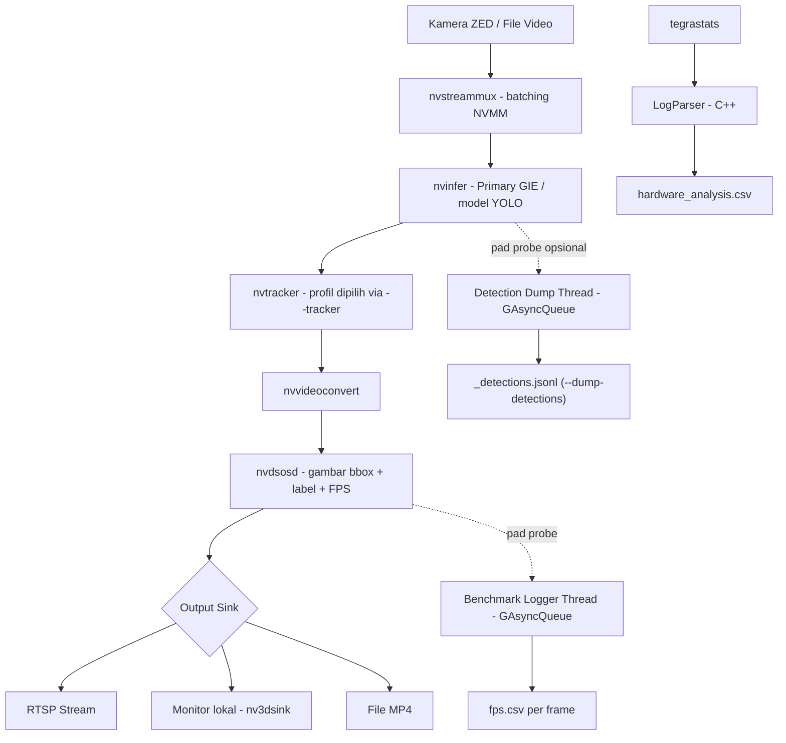

# BAB II — METODE PENELITIAN

## 2.1 Tempat dan Waktu Penelitian

Penelitian ini dilaksanakan di lingkungan Departemen Teknik Informatika, Fakultas Teknik,
Universitas Hasanuddin — nama laboratorium spesifik (mis. Laboratorium Jaringan
dan Visi Komputer) perlu dikonfirmasi penulis sesuai tempat aktual pelaksanaan pengujian
perangkat keras, karena belum tercatat secara eksplisit di dokumen proyek ini. Eksekusi
eksperimen inti (pengujian *runtime*/hardware pada Jetson Orin Nano) dilakukan pada tanggal
**19 Agustus 2026**, pukul 11:33–12:46 WITA (± 72 menit, termasuk *cooldown* antar-*run*),
menghasilkan 60 *run* benchmark (§2.6.1) sebagaimana tercatat pada metadata `run_info.txt` tiap
*run* (lihat rincian kondisi eksekusi di `BAB-3-Hasil-dan-Pembahasan.md` §3.1). Tahapan
persiapan (implementasi *pipeline*, konfigurasi model, dan penyusunan *tooling* otomasi
pengujian, §2.2.6) berlangsung pada rentang waktu sebelumnya di tahun 2026, mengikuti linimasa
pasca-seminar proposal.

## 2.2 Benda Uji dan Alat

### 2.2.1 Perangkat Keras

| Komponen | Spesifikasi |
|---|---|
| *Compute board* | NVIDIA **Jetson Orin Nano 4GB** — *System-on-Chip* (SoC) *embedded* berbasis arsitektur GPU Ampere, bagian dari keluarga Jetson Orin yang ditujukan untuk aplikasi *edge AI* berdaya rendah. Berbeda dari varian Jetson Orin NX dan Jetson AGX Orin, Jetson Orin Nano **tidak dilengkapi Deep Learning Accelerator (DLA)** — akselerator inferensi khusus yang terpisah dari GPU utama — sehingga strategi optimasi yang bergantung pada DLA (seperti pada proposal awal penelitian ini yang menargetkan Jetson AGX Orin) tidak dapat diterapkan pada perangkat ini (lihat `BAB-1-Pendahuluan.md` §1.1 dan §1.5). |
| Kamera | Stereolabs ZED (stereo), dipakai hanya sebagai sumber *stream* 2D — lihat batasan `BAB-1-Pendahuluan.md` §1.5 dan limitasi `../../docs/08_limitations_future_work.md` poin 1. Didukung pada FPS 15/30/60/100/120 (`--camera-fps`, default konfigurasi *benchmark*: 30 FPS). |

**Identifikasi SKU dan mode daya.** Unit yang dipakai adalah varian **4GB** (bukan 8GB).
Identifikasi ini didasarkan pada mode daya maksimum yang terbaca lewat `nvpmodel -q` pada
perangkat, yaitu **10W** — nilai ini unik untuk SKU 4GB pada *firmware* standar (non-*Super*):
modul 8GB pada *firmware* yang sama hanya memiliki mode 7W/15W (tidak ada mode 10W), sesuai
tabel *Operating Requirements* pada *datasheet* resmi NVIDIA (NVIDIA, 2024). Karena mode
maksimum yang terbaca adalah 10W — bukan 25W — perangkat juga dipastikan berjalan pada
konfigurasi daya **default** (7W/10W), bukan mode `MAXN_SUPER` (JetPack 6.2+), sehingga performa
GPU/CPU yang menjadi acuan Bab III mencerminkan batas atas mode *default* tersebut, bukan
performa puncak SoC. Identifikasi ini diturunkan dari pembacaan `nvpmodel`, bukan
inspeksi label fisik modul — penulis disarankan mengonfirmasi ulang dengan
`cat /proc/device-tree/model` di perangkat saat kembali tersedia, sebagai verifikasi independen.

**Tabel 2.1** Spesifikasi Jetson Orin Nano 4GB (NVIDIA, 2024)

| Komponen | Mode *default* (7W/10W) — dipakai penelitian ini | Mode `MAXN_SUPER` (tidak dipakai) |
|---|---|---|
| GPU | Ampere, 512 CUDA core, 16 Tensor core (generasi ke-3), hingga 625 MHz | hingga 1020 MHz |
| Performa AI (INT8) | 10 TOPS (*dense*) / 20 TOPS (*sparse*) | 17 TOPS (*dense*) / 34 TOPS (*sparse*) |
| CPU | 6-core Arm Cortex-A78AE (2 klaster: 4-core + 2-core), *system cache* 4MB, hingga 1,5 GHz/core | hingga 1,7 GHz/core |
| Memori | 4GB LPDDR5, bus 64-bit, *bandwidth* hingga 34 GB/s | hingga 51 GB/s |
| Mode daya tersedia | 7W / 10W / 25W (`MAXN_SUPER`) | — |
| DLA | Tidak tersedia | Tidak tersedia |

Sumber: NVIDIA (2024), tabel "AI Performance", "GPU Operation" (Tabel 2-1), "CPU Cluster",
"Memory Subsystem", dan "Operating Requirements".

### 2.2.2 Perangkat Lunak

| Komponen | Versi/Detail |
|---|---|
| *Inference SDK* | NVIDIA **DeepStream 7.1** (berbasis GStreamer) — lihat justifikasi arsitektur lengkap di §2.5.1 |
| *Precision runtime* | **FP16** (TensorRT) |
| Bahasa aplikasi utama | C++17 (`CMAKE_CXX_STANDARD 17`, `CMakeLists.txt:4-5`), dibangun dengan CMake ≥3.10 |
| *Library* inti | GStreamer 1.0, GLib 2.0, `nvdsgst_meta`/`nds_meta` (DeepStream *metadata API*) — `CMakeLists.txt:24-35` |
| *Parser custom* | `nvdsinfer_custom_impl_EfficientNMS` (`src/efficientnms_parser.cpp`, `CMakeLists.txt:41-66`), memerlukan CUDA Toolkit (dicari otomatis via `cuda_runtime_api.h`) |
| Evaluasi akurasi (proxy FP32) | Ultralytics `YOLO.val()` (Python, Kaggle GPU Tesla T4) |
| Evaluasi akurasi (*as-deployed* FP16) | `pycocotools.cocoeval.COCOeval` — lihat §2.6.1 poin 4 |
| *Profiling* hardware | `tegrastats` (bawaan Jetson Linux) — justifikasi pemilihan di §2.4 |

**Justifikasi pemilihan presisi FP16.** TensorRT adalah *runtime* inferensi *deep learning* dari
NVIDIA yang mengoptimalkan model terlatih (melalui *layer fusion*, kernel *auto-tuning*, dan
kuantisasi presisi) menjadi *engine* yang dieksekusi efisien pada GPU target. Tiga tingkat
presisi umum yang didukung adalah FP32 (presisi penuh, *baseline* akurasi), FP16 (setengah
presisi, memanfaatkan *Tensor Core* untuk percepatan dengan penurunan akurasi yang umumnya dapat
diabaikan), dan INT8 (kuantisasi bilangan bulat 8-bit, tercepat namun membutuhkan dataset
kalibrasi tambahan dan berisiko kehilangan akurasi lebih besar). Penelitian ini menggunakan
presisi **FP16** secara konsisten di seluruh model uji, dengan pertimbangan: Jetson Orin Nano
tidak memiliki DLA sehingga keuntungan INT8 khas DLA tidak berlaku (§2.2.1), sementara FP32 tidak
memanfaatkan penuh *Tensor Core* GPU Ampere pada perangkat ini untuk keuntungan akurasi yang
hampir tidak terasa. Perbandingan akurasi FP32-*proxy* (hasil `YOLO.val()` pada `.pt`) vs. FP16
*as-deployed* (hasil *pipeline* DeepStream sesungguhnya) menjadi bagian dari skenario pengujian
akurasi (§2.6.1 poin 4).

### 2.2.3 Dataset

Dataset KITTI dengan pemetaan ulang 3 kelas kustom (`0=car`, `1=van`, `2=truck`, lihat
`labels/labels_kitti_custom.txt`). *Split* validasi: **1.010 gambar, 4.722 instance**
(car 4.167, van 405, truck 150) — identik untuk seluruh model, sehingga hasil akurasi antar
model dapat dibandingkan langsung (`../../docs/02_dataset_and_training.md`,
`../../docs/05_accuracy_results.md`). Ketimpangan kelas (`van`/`truck` jauh lebih sedikit dari
`car`) dicatat sebagai limitasi statistik saat membahas hasil per-kelas
(`../../docs/08_limitations_future_work.md` poin 3).

### 2.2.4 Model Deteksi

YOLO adalah keluarga arsitektur deteksi objek *single-stage* yang memprediksi *bounding box* dan
kelas objek dalam satu kali *forward pass* jaringan, menjadikannya cocok untuk aplikasi
*real-time* dibanding pendekatan *two-stage* (mis. Faster R-CNN). Penelitian ini menguji empat
varian generasi YOLO kelas *nano/tiny* — dipilih karena kelas ukuran model yang setara (anggaran
komputasi kira-kira sebanding), sehingga selisih hasil antar model lebih mencerminkan perbedaan
arsitektur generasi ketimbang perbedaan skala model (`../../docs/01_scope_and_architecture.md`
§1.4). Salah satu perbedaan arsitektural penting antar generasi ini adalah pendekatan terhadap
NMS: sebagian model generasi baru (YOLOv10n, YOLO26n) bersifat *NMS-free* — tidak memerlukan
tahap NMS terpisah karena model sudah dilatih untuk menghasilkan prediksi tanpa duplikasi (lihat
catatan *parser* NMS-*free* di `../../docs/08_limitations_future_work.md`) — poin ini relevan
untuk interpretasi hasil RM2 di Bab III, karena optimasi NMS (EfficientNMS, §2.5.2) secara
inheren tidak berlaku sama untuk model NMS-*free*.

| Model | Params | GFLOPs | Konfigurasi NMS | File config |
|---|---|---|---|---|
| YOLOv8n | 3.006.233 | 8,1 | NMS bawaan `nvinfer` (*baseline*) | `config/pgie_yolov8n_kitti.txt` |
| YOLOv9t | 1.971.369 | 7,6 | NMS bawaan `nvinfer` (*baseline*) | `config/pgie_yolov9t_kitti.txt` |
| YOLOv10n | 2.265.753 | 6,5 | NMS-*free* (arsitektural) | `config/pgie_yolov10n_kitti.txt` |
| YOLO26n | 2.375.421 | 5,2 | NMS-*free* (arsitektural) | `config/pgie_yolov26n_kitti.txt` |
| YOLOv8n + EfficientNMS | 3.006.233 | 8,1 | NMS paralel (`EfficientNMS_TRT`) | `config/pgie_yolov8n_kitti_efficientnms.txt` |
| YOLOv9t + EfficientNMS | 1.971.369 | 7,6 | NMS paralel (`EfficientNMS_TRT`) | `config/pgie_yolov9t_kitti_efficientnms.txt` |

Total 6 konfigurasi model di atas menjadi dasar 12 skenario RM3 (6 model × 2 *tracker*, §2.6.1
poin 3). Perbandingan RM2 (NMS standar vs. paralel) hanya berlaku pada pasangan YOLOv8n/YOLOv9t
(model dengan varian *baseline* dan EfficientNMS yang setara) — YOLOv10n dan YOLO26n tidak
disertakan pada perbandingan RM2 karena keduanya sudah NMS-*free* secara arsitektural, sehingga
tidak ada pasangan pembanding yang setara.

Satu model tambahan, **YOLOv8n-COCO** (80 kelas, `config/pgie_yolov8n_coco.txt`), dipertahankan
hanya sebagai *sanity-check* umum kebenaran *pipeline* (mis. memverifikasi *parser*/*rendering*
berjalan benar di luar domain KITTI) — **bukan** kompetitor pada perbandingan akurasi/efisiensi
utama (`../../docs/01_scope_and_architecture.md` §1.4).

### 2.2.5 Konfigurasi Tracker

| Tracker | File config | Karakteristik singkat (justifikasi lengkap: §2.5.3) |
|---|---|---|
| NvDCF | `config/tracker_nvdcf.yml` | *Feature-based*, pemrosesan piksel penuh, akurasi/*robustness* tertinggi |
| NvSORT | `config/tracker_nvsort.yml` | *Motion-only* (Kalman filter + algoritma Hungarian), tanpa pemrosesan piksel, paling ringan |

Baseline implementasi proyek ini menggunakan profil NvDCF (`../../docs/01_scope_and_architecture.md`
§1.3), dengan kedua berkas konfigurasi di atas sudah tersedia di repositori proyek sejak awal
implementasi. Kedua profil ini dipilih karena mewakili dua ujung spektrum efisiensi komputasi
*tracker* yang tersedia di elemen `nvtracker` DeepStream — rincian justifikasi ilmiah pemilihan
kedua profil ini (termasuk sitasi dokumentasi resmi NVIDIA) ada di §2.5.3, sebagai bagian dari
perancangan sistem, bukan diulang di sini.

### 2.2.6 Tooling Otomasi Pengujian

- `scripts/build.sh` — kompilasi aplikasi C++ (`app`, `parser`/`src/log_parser.cpp`, *library*
  `nvdsinfer_custom_impl_EfficientNMS`).
- `scripts/run_benchmark.sh` — *harness* satu-*run*: menjalankan `app` dengan `--benchmark`
  (menulis `fps.csv` per-*frame*), merekam `tegrastats` konkuren (diproses jadi
  `hardware_analysis.csv`), dan mencatat metadata *run* ke `run_info.txt` (model, config,
  *tracker*, mode input/output, durasi, `git_commit`, mode `nvpmodel`, status `jetson_clocks`,
  *timestamp* mulai/selesai). Setiap *run* tersimpan di folder unik ber-*timestamp*
  (`data/benchmark/<model>/<timestamp>/`) — **tidak pernah** menimpa hasil *run* sebelumnya.
- `scripts/run_all_benchmark.sh` — orkestrasi otomatis 12 skenario (6 model × 2 *tracker*) secara
  berurutan: memaksa `nvpmodel -m 0` + `jetson_clocks` di awal, menjalankan tiap skenario lewat
  `run_benchmark.sh`, lalu jeda *cooldown* 60 detik + pembersihan cache (`sync` + `drop_caches`)
  antar skenario untuk stabilisasi termal.
- `scripts/prepare_eval_video.sh` dan `utils/eval_map/eval_deepstream_map.py` — infrastruktur
  pendukung verifikasi akurasi *as-deployed* FP16 (lihat status implementasi di §2.6.1 poin 4).

## 2.3 Tahapan Penelitian

Penelitian ini merupakan penelitian **eksperimental kuantitatif** yang membandingkan kinerja
konfigurasi *pipeline* deteksi-dan-*tracking* objek secara berpasangan (*baseline* vs.
*optimized*) pada instrumen dan kondisi pengujian yang dikontrol seketat mungkin — perangkat
keras yang sama (Jetson Orin Nano, §2.2.1), video input yang sama, mode daya yang sama
(`nvpmodel -m 0` + `jetson_clocks`), dan *harness* pengukuran yang sama (§2.2.6) untuk seluruh
skenario. Pendekatan ini dipilih karena ketiga rumusan masalah (`BAB-1-Pendahuluan.md` §1.2) pada
dasarnya menanyakan **efek dari mengganti satu komponen *pipeline*** terhadap kinerja
*real-time*, sehingga desain perbandingan terkontrol (bukan survei atau studi kualitatif) adalah
yang paling sesuai. Penelitian memiliki tiga sumbu eksperimen independen, masing-masing menjawab
satu rumusan masalah: (1) karakterisasi *baseline* (RM1), (2) *post-processing* NMS standar vs.
paralel (RM2), dan (3) *tracking* NvDCF vs. NvSORT (RM3, dibatasi pada efisiensi komputasi saja
— lihat `BAB-1-Pendahuluan.md` §1.5 poin 5 dan §2.5.3). Karena model yang dipakai adalah model
*pre-trained* (bukan dilatih ulang), akurasi deteksi bukan variabel yang dioptimasi; akurasi
hanya diperiksa sebagai *sanity check* pendukung (§2.6.1 poin 4).

Tahapan penelitian dilaksanakan secara bertahap sebagai berikut:

1. **Persiapan lingkungan** — *build* aplikasi (`scripts/build.sh`); verifikasi *engine*
   TensorRT (`.onnx_b1_gpu0_fp16.engine`) berhasil dibangun otomatis oleh `nvinfer` pada
   eksekusi pertama tiap model (spesifik perangkat/versi TensorRT — dihapus ulang bila
   berpindah perangkat).
2. **Definisi kriteria *real-time*** (§2.6.2) — ditetapkan sebelum pengujian dimulai, supaya
   analisis hasil (Bab III) tidak menyesuaikan ambang batas setelah melihat data.
3. **Pengukuran *baseline* (RM1)** — jalankan `scripts/run_benchmark.sh` untuk keempat model
   *baseline* (YOLOv8n, YOLOv9t, YOLOv10n, YOLO26n) dengan *tracker default* (NvDCF), video
   input tetap (`data/input/video_testing.mp4`), ukur FPS dan latensi per-komponen dari
   `fps.csv`.
4. **Pengukuran optimasi NMS paralel (RM2)** — jalankan `scripts/run_benchmark.sh` untuk varian
   EfficientNMS (YOLOv8n, YOLOv9t), bandingkan terhadap hasil langkah 3 pada pasangan model yang
   sama (kondisi lain tetap identik).
5. **Verifikasi akurasi *as-deployed* FP16** (pendukung, lihat status §2.6.1 poin 4) — dump
   deteksi mentah `NvDsObjectMeta` per model via `--dump-detections`, hitung mAP dengan
   `utils/eval_map/eval_deepstream_map.py`, bandingkan terhadap *proxy* FP32
   (`../../docs/05_accuracy_results.md`).
6. **Pengukuran efisiensi komputasi *tracking* (RM3)** — jalankan `scripts/run_all_benchmark.sh`
   (12 skenario penuh: 6 model × 2 *tracker*), kumpulkan `fps.csv` dan `hardware_analysis.csv`
   tiap skenario.
7. **Analisis dan perbandingan** — agregasi seluruh hasil (*baseline*, NMS, *tracker*, akurasi
   pendukung) terhadap kriteria evaluasi (§2.6.2), disusun jadi tabel/grafik untuk Bab III.

Sesuai rekomendasi protokol *benchmark* (`../../docs/04_benchmark_protocol.md`), setiap skenario
diulang **5 repetisi** dengan jeda *cooldown* 60 detik antar repetisi/skenario (stabilisasi
termal), dan 10 detik awal tiap *run* (*warm-up*) dibuang saat agregasi (lihat kondisi eksekusi
aktual di `BAB-3-Hasil-dan-Pembahasan.md` §3.1).

## 2.4 Teknik Pengumpulan Data

Data dikumpulkan secara otomatis melalui dua kanal instrumentasi yang berjalan bersamaan selama
setiap *run*, keduanya dirancang agar **tidak membebani jalur komputasi kritis** yang sedang
diukur (arsitektur *threading* lengkap ada di §2.5.4):

1. **Data performa *runtime*** — *throughput* (FPS) dan latensi *end-to-end* maupun latensi
   per-komponen *pipeline* (`Lat_PreMux_ms`, `Lat_Mux_ms`, `Lat_Infer_ms`, `Lat_Tracker_ms`,
   `Lat_PreOSD_ms`, `Lat_OSD_ms`, `Lat_Output_ms`) diambil melalui *pad probe* GStreamer yang
   dipasang pada elemen-elemen kunci *pipeline* (lihat §2.5.1), dicatat ke berkas `fps.csv`
   per-*frame* (`../../docs/04_benchmark_protocol.md`).
2. **Data hardware** — utilisasi GPU (%), CPU per-*core* (%), RAM, dan konsumsi daya per-*rail*
   diambil dari utilitas bawaan Jetson Linux `tegrastats` (interval 1000 ms), diproses oleh
   *parser* C++ (`src/log_parser.cpp`) menjadi berkas `hardware_analysis.csv`
   (`../../docs/04_benchmark_protocol.md`). `tegrastats` dipilih dibanding `nvidia-smi` karena
   `nvidia-smi` tidak tersedia di Jetson (arsitektur *driver* berbeda), sedangkan `tegrastats`
   adalah utilitas bawaan resmi dengan *overhead* rendah yang mampu membaca *rail* daya *on-SoC*
   langsung tanpa perangkat tambahan.
3. **Data akurasi *as-deployed* FP16** (pendukung, §2.6.1 poin 4) — deteksi mentah
   `NvDsObjectMeta` (kelas, *bounding box*, *confidence*) didump per-*frame* ke JSON Lines lewat
   flag CLI `--dump-detections`, kemudian dikonversi ke format COCO-*results* dan dihitung mAP-nya
   dengan `pycocotools.cocoeval.COCOeval` (`utils/eval_map/eval_deepstream_map.py`).

Ketiga kanal di atas berjalan independen dari jalur render/inferensi utama: penulisan berkas CSV
maupun JSON Lines dilakukan di *thread* terpisah lewat *queue non-blocking* (`GAsyncQueue`),
bukan langsung di dalam *pad probe* itu sendiri, agar biaya I/O pencatatan data tidak ikut
tercampur ke dalam metrik latensi yang sedang diukur — detail arsitektur *threading* ini
dijelaskan di §2.5.4.

## 2.5 Perancangan dan Implementasi Sistem

### 2.5.1 Arsitektur Pipeline DeepStream

Penelitian ini secara eksplisit membatasi diri pada *perception layer* ADAS — tahap deteksi dan
*tracking* objek dari citra kamera — dan tidak mencakup lapisan prediksi, *planning*, maupun
kontrol kendaraan (`../../docs/01_scope_and_architecture.md` §1.1 dan `BAB-1-Pendahuluan.md`
§1.5). NVIDIA DeepStream adalah SDK untuk membangun aplikasi *streaming analytics* berbasis
GStreamer yang dioptimalkan untuk perangkat keras NVIDIA, mencakup tahap *decode* video,
inferensi *deep learning*, *object tracking*, hingga penggambaran hasil (*on-screen display*)
dan *output* akhir dalam satu *pipeline* tunggal. Karakteristik kunci DeepStream yang relevan
untuk penelitian ini adalah penggunaan *buffer* **NVMM (NVIDIA Memory Manager)**, yang
memungkinkan seluruh tahap *pipeline* (*decode* → inferensi → *tracking* → *encode*) berjalan di
memori GPU tanpa banyak *copy* data bolak-balik ke CPU (*zero-copy*) — lebih efisien untuk
kebutuhan *real-time* pada SoC *embedded* dibanding *pipeline* OpenCV manual yang biasanya
bolak-balik CPU↔GPU tiap tahap. Karakteristik ini menjadi alasan utama pemilihan DeepStream
dibanding pipeline manual berbasis OpenCV + TensorRT/ONNXRuntime
(`../../docs/01_scope_and_architecture.md` §1.4).

Implementasi ada di `src/main.cpp` (kelas `DeepStreamApplication`), mengikuti urutan pemanggilan
`buildPipeline()`/`buildInput()`/`buildOutput()`, terdiri atas elemen `nvstreammux` (batching
*frame* ke *buffer* NVMM), `nvinfer` (Primary GIE — inferensi model YOLO, §2.2.4), `nvtracker`
(asosiasi ID objek antar *frame*, profil dipilih via §2.5.3), `nvvideoconvert`, dan `nvdsosd`
(penggambaran *bounding box*), sebelum diteruskan ke *output sink* (RTSP, layar lokal, atau
berkas MP4). Detail lengkap ada di `../../docs/01_scope_and_architecture.md` §1.2 dan §1.4.

### 2.5.2 Integrasi Plugin EfficientNMS_TRT

*Non-Maximum Suppression* (NMS) adalah algoritma *post-processing* yang menyaring kandidat
*bounding box* hasil deteksi mentah suatu model, membuang *box* yang tumpang tindih (berdasarkan
ambang *Intersection-over-Union*/IoU) dengan *box* lain yang memiliki skor keyakinan lebih tinggi
untuk objek yang sama. Implementasi NMS standar (mis. *GreedyNMS*) bersifat sekuensial dan sering
dieksekusi di CPU, sehingga berpotensi menjadi *bottleneck* pada *pipeline* inferensi *real-time*
di perangkat *edge* — motivasi inilah yang mendasari berbagai penelitian akselerasi NMS yang
dirujuk di `BAB-1-Pendahuluan.md` §1.1 sebagai dasar rumusan masalah #2.

Penelitian ini mengimplementasikan optimasi NMS menggunakan plugin **`EfficientNMS_TRT`** bawaan
TensorRT (lihat `../../utils/trt_efficientnms/README.md`), yang menyisipkan algoritma NMS sebagai
bagian dari *graph* TensorRT itu sendiri sehingga dieksekusi penuh oleh kernel GPU tanpa *loop*
NMS Python/CPU pada *engine* hasil, dan tanpa mengubah arsitektur ONNX/*engine* *baseline*
(`EfficientNMS_TRT` dipasang sebagai *tail* tambahan yang bergantung pada *output* detektor).
Pendekatan ini **berbeda** dari yang digambarkan pada diagram arsitektur proposal
awal (kernel CUDA kustom dengan tahap *ParallelDispatch → Workers evaluasi pasangan IoU → Custom
Map Kernel → ParallelReduce*) — proposal menggambarkan kernel paralel yang ditulis dari nol,
sedangkan implementasi final memakai *plugin* siap pakai vendor. Perbedaan ini perlu dijelaskan
secara konsisten pada Bab I, II, dan III (lihat anotasi terkait di `BAB-1-Pendahuluan.md` §1.2
poin 2).

Implementasi konkret melibatkan dua bagian: (1) *parser custom*
`nvdsinfer_custom_impl_EfficientNMS` (`src/efficientnms_parser.cpp`) yang membaca *output*
tambahan dari *tail node* `EfficientNMS_TRT` pada *engine* TensorRT, dan (2) berkas konfigurasi
`nvinfer` khusus untuk kedua model yang mendukung varian ini (`config/pgie_yolov8n_kitti_efficientnms.txt`,
`config/pgie_yolov9t_kitti_efficientnms.txt`, §2.2.4). Model YOLOv10n dan YOLO26n tidak
memerlukan integrasi ini karena keduanya sudah *NMS-free* secara arsitektural (§2.2.4).

### 2.5.3 Konfigurasi Multi-Object Tracking

*Object tracking* pada *pipeline* video mengasosiasikan deteksi objek antar *frame* berurutan
dengan sebuah ID unik, mengurangi efek *flicker* (objek terdeteksi lalu hilang sesaat akibat
kegagalan deteksi sesaat, mis. karena *partial occlusion*) — lihat
`../../docs/01_scope_and_architecture.md` §1.4. NVIDIA DeepStream menyediakan elemen `nvtracker`
yang dapat dikonfigurasi dengan beberapa profil algoritma *tracking* melalui berkas YAML.
Penelitian ini membandingkan dua profil yang mewakili ujung-ujung spektrum efisiensi komputasi
(§2.2.5):

- **NvDCF** (*Discriminative Correlation Filter*): *tracker* berbasis filter korelasi dengan
  fitur visual yang dipelajari (*learned feature*), umumnya lebih akurat dalam mempertahankan
  identitas objek pada kondisi oklusi parsial, namun membutuhkan komputasi lebih berat karena
  proses ekstraksi fitur dan pencarian korelasi per objek per *frame*.
- **NvSORT**: *tracker* klasik berbasis filter Kalman dan algoritma Hungarian untuk asosiasi data
  (pendekatan SORT — *Simple Online and Realtime Tracking*), tanpa ekstraksi fitur visual
  sehingga jauh lebih ringan secara komputasi dibanding pendekatan berbasis *deep/correlation
  feature* seperti NvDCF, dengan kompromi pada ketahanan terhadap oklusi.

Trade-off akurasi-vs-komputasi antara pendekatan *feature-based* (NvDCF) dan *motion-only*
(NvSORT) inilah yang mendasari rumusan masalah #3 — namun sesuai `BAB-1-Pendahuluan.md` §1.5
poin 5, penelitian ini **murni mengukur sisi efisiensi komputasi** (FPS, `Lat_Tracker_ms`,
utilisasi *resource*) dan tidak mengukur sisi kualitas asosiasi ID (MOTA/IDF1/ID *switch*).

Pembatasan ini bukan sekadar konsekuensi keterbatasan dataset, melainkan konsisten dengan
definisi sumbu perbandingan yang sudah melekat pada desain kedua profil *tracker* itu sendiri.
Dokumentasi resmi NVIDIA (*Gst-nvtracker* plugin manual, DeepStream SDK) menyatakan NvSORT "tidak
melibatkan pemrosesan data piksel sama sekali" sehingga "efisien secara komputasi", sedangkan
NvDCF memakai *visual tracker* berbasis *discriminative correlation filter* — yaitu pemrosesan
fitur piksel per objek per *frame* (NVIDIA, DeepStream SDK Plugin Manual, bagian
*Gst-nvtracker*). Postingan blog resmi NVIDIA Developer soal DeepStream SDK 6.2 juga secara
eksplisit menempatkan NvSORT sebagai *"lightweight, CPU-only implementation but still
competitively accurate"* dan NvDCF sebagai penghasil *"best accuracy and robustness"* lewat
kombinasi *conventional ML* (DCF) dan *deep learning* (ReID) (Shin & Li, 2023) — mengonfirmasi
bahwa sumbu akurasi-vs-komputasi ini memang didesain vendor sebagai *trade-off* yang sudah
diketahui karakteristiknya secara kualitatif, bukan sesuatu yang perlu diukur ulang oleh
penelitian ini untuk membuat pertanyaan "*tracker* mana yang lebih efisien secara komputasi"
valid dijawab.

Pendekatan mengevaluasi pilihan algoritma murni dari sisi biaya komputasi — dengan karakter
akurasi/kualitas sudah diketahui dan tidak diukur ulang — juga punya preseden metodologis yang
mapan di luar domain *tracking*: *benchmark* **MLPerf Mobile Inference Benchmark** (Janapa Reddi
dkk., 2022) menetapkan pada setiap tugas pengujian sebuah ambang akurasi dan kualitas minimum
sebagai syarat kelulusan tetap, sementara metrik yang secara eksplisit dibandingkan dan
dilaporkan meningkat antar generasi submisi adalah latensi dan *throughput* — struktur yang
serupa dengan penelitian ini, karena karakteristik akurasi setiap *tracker* sudah
didokumentasikan kualitatif oleh vendor, dan kontribusi penelitian ini adalah mengkuantifikasi
biaya komputasinya secara spesifik pada perangkat Jetson Orin Nano yang belum ada di literatur
(`BAB-1-Pendahuluan.md` §1.1). Preseden ini relevan pula karena MLPerf Mobile secara khusus
menyasar evaluasi performa pada perangkat *on-device*/*edge* dengan sumber daya terbatas —
konteks yang sejalan dengan platform Jetson Orin Nano pada penelitian ini, alih-alih server
kelas *datacenter*.

Adapun ketidaktersediaan dataset ber-anotasi *track ID* berurutan tetap menjadi alasan pendukung
(bukan alasan tunggal): metrik kualitas *tracking* (MOTA/IDF1/ID *switch*) secara struktural
membutuhkan *ground truth* dengan *field* identitas objek yang konsisten antar *frame* (mis.
*benchmark* KITTI Tracking, MOTChallenge MOT16/17/20), berbeda dari dataset deteksi *single-frame*
seperti KITTI 2D Object Detection yang dipakai penelitian ini (kotak per *frame* tanpa *field* ID
lintas-*frame*) — sehingga menambah metrik ini bukan sekadar menghitung ulang, melainkan
membutuhkan dataset dan proses anotasi baru yang di luar ruang lingkup penelitian.

### 2.5.4 Skema Threading Logging

Menulis berkas CSV/JSON Lines langsung di dalam *pad probe* (jalur kritis *render* tiap *frame*)
akan menambah *I/O latency* ke jalur yang sedang diukur, mencemari metrik yang seharusnya murni
mengukur biaya komputasi *pipeline*. Untuk menghindari ini, *logger benchmark* dan *logger* dump
deteksi (§2.4) dirancang berjalan pada *thread* terpisah dari *thread* utama GStreamer, memakai
`GAsyncQueue` sebagai antrean *non-blocking*: *pad probe* hanya menyalin data mentah ke antrean
(operasi yang sangat cepat) dan langsung mengembalikan kendali ke *pipeline*, sementara *thread*
terpisah mengambil data dari antrean dan menuliskannya ke berkas secara asinkron. Dengan pola
ini, proses pengukuran didesain untuk **tidak mengganggu metrik yang diukur** — prinsip yang
sama dipakai baik pada *pad probe fps.csv* (§2.4 poin 1) maupun *pad probe* dump deteksi
(`--dump-detections`, §2.6.1 poin 4).

## 2.6 Skenario Pengujian dan Kriteria Evaluasi

### 2.6.1 Skenario Pengujian

1. **Baseline *pipeline* (RM1)** — empat model (YOLOv8n, YOLOv9t, YOLOv10n, YOLO26n), *tracker*
   *default* NvDCF, video input tetap, ukur FPS keseluruhan dan latensi per-komponen
   (`Lat_PreMux_ms`, `Lat_Mux_ms`, `Lat_Infer_ms`, `Lat_Tracker_ms`, `Lat_PreOSD_ms`,
   `Lat_OSD_ms`, `Lat_Output_ms` dari `fps.csv`).
2. **NMS standar vs. NMS paralel EfficientNMS (RM2)** — pasangan YOLOv8n/YOLOv9t *baseline* vs.
   varian EfficientNMS, kondisi lain identik terhadap skenario 1. Fokus perbandingan pada
   `Lat_Infer_ms` (tahap yang mencakup *post-processing* NMS) dan FPS keseluruhan.
3. **Efisiensi komputasi *tracking* (RM3)** — jalankan `scripts/run_all_benchmark.sh` untuk 12
   skenario (6 model × 2 konfigurasi *tracker*: NvDCF/NvSORT). Bandingkan `Lat_Tracker_ms`
   (median & p95) dan `hardware_analysis.csv` (GPU%, CPU/*core*, RAM, daya) antar konfigurasi
   *tracker*. **Tidak** mengukur kualitas/akurasi *tracking* (*ID switch*, MOTA/IDF1) — lihat
   `BAB-1-Pendahuluan.md` §1.5 poin 5 dan §2.5.3.
4. **Verifikasi akurasi *as-deployed* FP16 (pendukung, bukan bagian dari rumusan masalah inti)**
   — mengukur mAP langsung dari keluaran `NvDsObjectMeta` *pipeline* DeepStream FP16 pada 1.010
   gambar val KITTI yang sama, dibandingkan terhadap *proxy* FP32
   (`../../docs/05_accuracy_results.md`), untuk memastikan tidak ada penurunan akurasi
   tersembunyi akibat kuantisasi/*parsing custom* (`../../docs/03_deployment_pipeline.md` §3.4).

   **Status implementasi (per 2026-08-14)**: infrastrukturnya **sudah selesai
   diimplementasikan di kode** (`git log` — komit "feat: add as-deployed detection dump for
   FP16 verification"):
   - `--dump-detections <path>` (flag CLI baru di `src/main.cpp`, pola sama seperti
     `--benchmark`) — probe di *src pad* `primary-inference` mendump `NvDsObjectMeta` mentah
     (kelas, *bounding box*, *confidence*) per *frame* ke JSON Lines lewat *thread* async
     terpisah (pola sama seperti *logger benchmark*, lihat §2.5.4).
   - `scripts/prepare_eval_video.sh` — mengubah folder gambar val menjadi satu video *lossless*
     (`ffmpeg`, `-crf 0`) + `manifest.csv` (pemetaan *frame index* → nama file → resolusi asli),
     supaya bisa diputar lewat `--input file` yang sudah ada tanpa perlu membangun dukungan
     *image-sequence* baru di *pipeline* C++.
   - `utils/eval_map/eval_deepstream_map.py` — mengkonversi `manifest.csv` + hasil dump JSON
     Lines menjadi format COCO-*results*, *rescale bbox* dari kanvas `nvstreammux` (1280×720)
     balik ke resolusi gambar asli per *frame*, lalu menghitung mAP dengan
     `pycocotools.cocoeval.COCOeval` (keseluruhan dan per kelas).

   **Yang belum dilakukan**: (a) ekspor 1.010 gambar val + label dari *notebook* Kaggle ke
   perangkat lokal/Jetson (`data/eval/kitti_val/{images/,labels/}`) — perlu memastikan *split*
   yang diekspor **identik** dengan *split* yang menghasilkan angka Bab III (cek *seed*/`args.yaml`
   di *notebook*, supaya perbandingan FP16 vs FP32 *apple-to-apple*); (b) eksekusi nyata di Jetson
   untuk keempat model; (c) verifikasi visual *sanity-check* hasil *rescale bbox* sebelum angka
   mAP dipercaya; (d) *update* `../../docs/05_accuracy_results.md` §5.6 dan
   `../../docs/08_limitations_future_work.md` dengan hasil aktual. Karena statusnya
   infrastruktur-siap-tapi-belum-dieksekusi, skenario ini ditulis di sini sebagai **rencana
   pengujian pendukung**, bukan hasil yang sudah ada — hasil aktualnya baru bisa masuk Bab III
   setelah langkah (a)-(d) selesai.

### 2.6.2 Kriteria Evaluasi

Dua kelompok metrik evaluasi dipakai, mengikuti pembagian pada proposal (§"Analisis dan
Benchmarking") dan implementasi *tooling* yang sudah tersedia (§2.4): **kualitas deteksi**
(*precision*, *recall*, mAP pada IoU *threshold* 0,5 dan rentang 0,5:0,95 — dihitung dengan
`pycocotools.cocoeval.COCOeval` untuk hasil *as-deployed* FP16, dan `Ultralytics YOLO.val()`
untuk *baseline* FP32-*proxy*) dan **performa runtime/hardware** (FPS, latensi *end-to-end* dan
per-komponen, serta utilisasi GPU/CPU/RAM/daya).

| Sumbu | Metrik | Kriteria |
|---|---|---|
| RM1 (*baseline*) | FPS keseluruhan | *Real-time* didefinisikan sebagai **throughput ≥ 30 FPS** (mengikuti konfigurasi *default* kamera ZED pada `scripts/run_benchmark.sh` dan standar ADAS *safety-critical* *perception layer*) |
| RM1 (*baseline*) | Latensi *end-to-end* | Dilaporkan sebagai persentil **p95/p99**, bukan hanya rata-rata — supaya *outlier*/*jitter* (relevan untuk *safety-critical*, lihat `BAB-1-Pendahuluan.md` §1.1) tidak tersembunyi di balik rata-rata |
| RM2 (NMS) | FPS & `Lat_Infer_ms` | Selisih (Δ) *baseline* vs. EfficientNMS pada pasangan model yang sama; peningkatan dianggap bermakna jika Δ konsisten di seluruh repetisi (bukan kebetulan *noise* satu *run*) |
| RM3 (*tracker*) | FPS keseluruhan, `Lat_Tracker_ms` (median & p95), GPU%/CPU%/RAM/daya | **Murni efisiensi komputasi** — sesuai `BAB-1-Pendahuluan.md` §1.5 poin 5. **Tidak** ada ambang akurasi *tracking* (*ID switch*, MOTA/IDF1) yang perlu dipenuhi; ini konsisten dengan pendekatan MLPerf Mobile Inference Benchmark yang menjadikan akurasi ambang kelulusan tetap (bukan variabel dibandingkan) — lihat §2.5.3 |
| Akurasi (pendukung, §2.6.1 poin 4) | mAP50, mAP50-95 (*as-deployed* FP16 vs. *proxy* FP32) | Bukan variabel dibandingkan antar model, melainkan **kriteria *sanity-check* pass/fail**: selisih diharapkan kecil (ambang pasti, mis. <1–2 poin, ditentukan penulis berdasarkan referensi literatur umum FP16-vs-FP32 setelah data aktual tersedia) |

