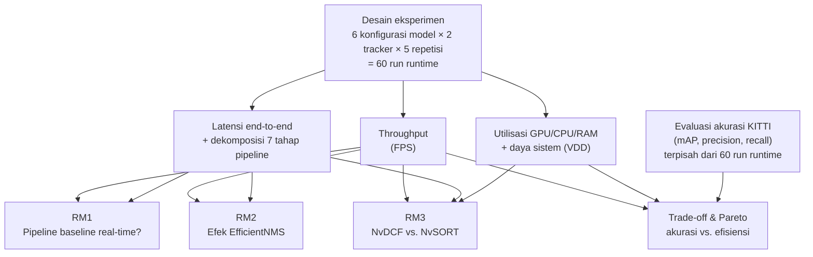

# BAB III: HASIL DAN PEMBAHASAN

## 3.1 Kondisi Eksekusi dan Parameter Baseline

*Pipeline* DeepStream berhasil dikompilasi dan dijalankan penuh di Jetson Orin Nano untuk keenam
konfigurasi model yang dikombinasikan dengan kedua konfigurasi *tracker*. Lapisan orkestrasi
otomatis menjalankan seluruh **12 skenario (6 model × 2 *tracker*) × 5 repetisi = 60 *run***
secara berurutan tanpa intervensi manual di antara *run*, sesuai tahap keenam metodologi
penelitian. Seluruh 60 *run* berhasil menghasilkan ketiga artefak pencatatan yang diharapkan,
yaitu log performa per-*frame*, log utilisasi perangkat keras, dan metadata proses pengujian,
masing-masing pada lokasi tersendiri yang tidak menimpa hasil sebelumnya; tidak ada *run* yang
gagal atau perlu diulang.

| Parameter | Nilai |
|---|---|
| Versi kode sumber | Konsisten di seluruh 60 *run* (satu *commit* tunggal) |
| Video input | Identik di seluruh *run*, sesuai variabel terkontrol pada protokol pengujian |
| Mode keluaran | Berkas (*encode* MP4) |
| Mode daya perangkat | 10 W, satu-satunya mode performa tinggi yang tersedia pada varian Jetson Orin Nano 4GB yang dipakai; diaktifkan sekali di awal *batch* sebelum ke-60 *run* |
| Penguncian *clock* perangkat | Dikunci di awal *batch* dengan mekanisme yang menghentikan seluruh proses pengujian pada *run* pertama bila langkah penguncian gagal, sehingga status kunci pada 60 *run* berikutnya terjamin konsisten |
| Pengukuran latensi | Diaktifkan otomatis di seluruh *run* |
| Interval pencuplikan utilitas pemantauan perangkat keras | 1.000 milidetik |
| Rentang waktu eksekusi *batch* | 2026-08-19 11:33–12:46 WITA (± 72 menit, termasuk *cooldown* 60 detik antar-*run*) |

**Catatan metodologis**: metadata pengujian pada masing-masing *run* mencatat galat izin akses
pada kolom status penguncian *clock*. Ini **bukan** indikasi bahwa *clock* tidak terkunci: galat
ini berasal dari pemeriksaan status yang berjalan sebagai proses anak tanpa privilese
administratif, terpisah dari langkah pengunci *clock* yang sesungguhnya (dijalankan sekali di
awal orkestrasi *batch* dengan privilese administratif penuh). Karena mekanisme orkestrasi
otomatis menghentikan seluruh proses pada kegagalan langkah manapun, kegagalan pada langkah
pengunci itu sendiri akan menghentikan seluruh *batch* di *run* pertama, sehingga 60 *run* yang
berhasil selesai secara konsisten mengindikasikan langkah penguncian berhasil. Kelemahan
pencatatan status ini (bukan kelemahan pengujian) dicantumkan sebagai catatan transparansi, bukan
disembunyikan.

Durasi setiap *run* individual relatif singkat (± 13–20 detik *wall-clock*, mengikuti panjang
video input) karena berkas input diputar apa adanya tanpa batas durasi eksplisit yang
dikonfigurasi. Agregasi membuang 10 detik pertama setiap *run* sebagai *warm-up* (mengikuti
rekomendasi protokol pengujian), sehingga jumlah *frame* yang tersisa untuk statistik per
skenario berkisar 633–1.399 *frame* (gabungan 5 repetisi), lebih sedikit dibanding rekomendasi
klip 180 detik pada protokol. Implikasi keterbatasan ini dibahas lebih lanjut pada pembahasan
keterbatasan sistem di akhir bab ini.

Data mentah 60 *run* diagregasi menjadi ringkasan per skenario (rerata antar-5-repetisi) dan data
mentah per *run* (dipakai untuk uji signifikansi pada pembahasan optimasi NMS dan efisiensi
*tracking*), ditambah grafik distribusi FPS per model dan per *tracker*. Data ini kemudian
digabung dengan hasil akurasi KITTI menjadi rangkuman *trade-off* dan grafik Pareto, dipakai pada
pembahasan akhir bab ini.

Diagram berikut memetakan **struktur pengukuran** bab ini: dari desain eksperimen, tiga kelompok
metrik *runtime* yang dicatat per *run*, hingga rumusan masalah (RM) mana yang dijawab tiap
kelompok metrik pada subbab berikutnya, bukan sekadar mengulang alur agregasi data di atas.

Peta ini menegaskan bahwa akurasi KITTI **tidak** berasal dari 60 *run* pengujian *runtime* di
atas: keduanya adalah dua sumber data independen yang baru digabung pada tahap akhir untuk
analisis *trade-off* pada pembahasan akhir bab ini, bukan bagian dari pipa agregasi *runtime*
yang sama.

## 3.2 Hasil Pengujian Kinerja Baseline Pipeline (Menjawab RM1)

### 3.2.1 Analisis Throughput (FPS)

Skenario *baseline* memakai *tracker default* NvDCF, sesuai skenario pengujian pertama pada
protokol metodologi penelitian.

| Model | Avg FPS | Median FPS | Std FPS | Ambang (vs. 30 FPS) |
|---|---|---|---|---|
| YOLOv8n | 66,77 | 66,52 | 0,51 | +123% |
| YOLOv9t | **51,52** | **51,73** | 0,61 | +72% |
| YOLOv10n | 67,02 | 67,22 | 0,40 | +123% |
| YOLO26n | 65,66 | 65,45 | 1,02 | +119% |

**Seluruh model *baseline* jauh melampaui ambang *real-time* 30 FPS**, bahkan YOLOv9t yang paling
lambat sekalipun mencapai rerata 51,52 FPS (± 72% di atas ambang). Pemenuhan ambang ini juga
diverifikasi tidak hanya pada rerata, tetapi pada **setiap** dari 60 *run* individual (bukan hanya
rerata skenario, agar *run* tunggal yang kebetulan lambat tidak tersembunyi di balik rerata):

| Model | Tracker | FPS minimum (dari 5 repetisi) | FPS maksimum | Status vs. ambang 30 FPS |
|---|---|---|---|---|
| YOLOv8n | NvDCF | 66,43 | 67,66 | Lulus (+121%) |
| YOLOv8n | NvSORT | 66,49 | 67,41 | Lulus (+122%) |
| YOLOv9t | NvDCF | 50,88 | 52,29 | Lulus (+70%) |
| YOLOv9t | NvSORT | 66,90 | 67,23 | Lulus (+123%) |
| YOLOv10n | NvDCF | 66,55 | 67,40 | Lulus (+122%) |
| YOLOv10n | NvSORT | 67,31 | 67,37 | Lulus (+124%) |
| YOLO26n | NvDCF | 64,27 | 67,06 | Lulus (+114%) |
| YOLO26n | NvSORT | 67,08 | 67,34 | Lulus (+124%) |
| YOLOv8n+EfficientNMS | NvDCF | 66,42 | 66,82 | Lulus (+121%) |
| YOLOv8n+EfficientNMS | NvSORT | 66,94 | 67,43 | Lulus (+123%) |
| YOLOv9t+EfficientNMS | NvDCF | **49,89** | 51,18 | Lulus (+66%) |
| YOLOv9t+EfficientNMS | NvSORT | 66,75 | 67,73 | Lulus (+123%) |

**Seluruh 60 *run*, tanpa kecuali, memenuhi kriteria *real-time* ≥ 30 FPS**, bahkan skenario
paling lambat (YOLOv9t+EfficientNMS dengan NvDCF, FPS minimum 49,89) masih melampaui ambang
sebesar 66%. Ini menjawab bagian inti RM1: keempat model *baseline* memenuhi kriteria *real-time*
pada Jetson Orin Nano dengan margin yang besar, sehingga margin tersebut dapat "dikonversi" untuk
mengejar akurasi lebih tinggi pada pembahasan *trade-off* di akhir bab ini tanpa mengorbankan
kepatuhan *real-time*. Rincian FPS pada varian EfficientNMS dan varian *tracker* NvSORT dibahas
lebih lanjut masing-masing pada subbab optimasi NMS paralel dan subbab efisiensi *tracking*.

**Catatan lingkup pengujian**: hasil di atas berasal dari protokol berbasis berkas video
terkontrol menggunakan satu video input yang identik di seluruh *run*, bukan dari kamera ZED
*live* secara langsung. Keputusan ini disengaja (sumber video tetap agar setiap model "melihat"
input yang identik, sehingga hasil antar-model benar-benar sebanding). Validasi tambahan pada
aliran kamera ZED *live* belum dilakukan pada laporan ini dan dicatat sebagai pekerjaan lanjutan
pada pembahasan keterbatasan sistem.

**Gambar 3.1** Distribusi FPS per model (seluruh *run*, kedua konfigurasi *tracker* digabung)

Grafik di atas memvisualkan sebaran FPS pada Tabel di atas dalam bentuk kotak-garis: keempat
model *baseline* tampak terkumpul rapat di kisaran 65–68 FPS, sementara YOLOv9t menunjukkan
sebaran dua-modus (*bimodal*) yang jauh lebih lebar, konsekuensi langsung dari interaksi
model-*tracker* yang dibahas lebih rinci pada subbab dampak algoritma *tracking* terhadap FPS.

### 3.2.2 Analisis Latensi End-to-End

| Model | Average Latensi (ms) | Average P95 Latensi (ms) |
|---|---|---|
| YOLOv8n | 273,35 | 329,10 |
| YOLOv9t | **457,67** | **536,32** |
| YOLOv10n | 247,48 | 299,46 |
| YOLO26n | 355,56 | 409,20 |

Latensi *end-to-end* pada Tabel di atas sengaja dilaporkan sebagai rerata **P95** selain rerata
keseluruhan, mengikuti kriteria evaluasi RM1, agar *outlier*/*jitter* (relevan untuk aplikasi
*safety-critical* seperti ADAS) tidak tersembunyi di balik rerata. **YOLOv9t adalah *outlier* yang
konsisten dengan temuan akurasi pada evaluasi GPU *cloud*** yang mencatat YOLOv9t sebagai model
dengan waktu inferensi paling lambat pada GPU *cloud* walau parameternya paling kecil. Di Jetson,
pola ini terulang dan makin nyata pada sisi latensi: rerata 457,67 ms dan rerata P95 536,32 ms,
jauh di atas ketiga model lain (rerata 247,48–355,56 ms, rerata P95 299,46–409,20 ms). Selisih
antara rerata dan P95 pada YOLOv9t (~78,7 ms) juga lebih besar dibanding model lain (~52–56 ms),
mengindikasikan sebaran *jitter* yang lebih lebar pada model ini, sebuah pertimbangan penting jika
YOLOv9t hendak dipakai pada sistem *safety-critical* yang menuntut latensi terprediksi, bukan
sekadar rerata rendah.

### 3.2.3 Dekomposisi Latensi Per-Komponen

Rincian latensi rerata per-komponen *pipeline* mengurai kontribusi tiap tahap terhadap total
latensi pada tabel analisis latensi *end-to-end* sebelumnya:

| Model | Pra-*multiplexing* | *Multiplexing* | Inferensi | *Tracking* | Pra-OSD | OSD | *Output* |
|---|---|---|---|---|---|---|---|
| YOLOv8n | 213,84 | 14,09 | 19,21 | 10,98 | ~0,01 | 9,34 | 5,87 |
| YOLOv9t | **360,92** | 27,48 | 28,65 | **18,93** | ~0,01 | 13,76 | 7,93 |
| YOLOv10n | 205,36 | 10,11 | 16,72 | 3,53 | ~0,01 | 7,08 | 4,67 |
| YOLO26n | 279,70 | 21,87 | 22,88 | 13,63 | ~0,01 | 10,95 | 6,52 |

**Gambar 3.2** Dekomposisi latensi per-komponen, model *baseline* dengan *tracker* NvDCF

Diagram batang bertumpuk di atas memvisualkan proporsi Tabel di atas: tahap pra-*multiplexing*
secara konsisten mendominasi total latensi pada seluruh model, dengan kontribusinya pada YOLOv9t
yang tampak jelas paling besar secara absolut dibanding ketiga model lain.

Dua temuan utama menjelaskan *bottleneck* per-komponen:

1. **Latensi tahap pra-*multiplexing* YOLOv9t (360,92 ms) jauh di atas model lain (~205–280 ms).**
   Tahap ini mengukur waktu tunggu *buffer* di *decoder*/antrean sebelum masuk ke tahap
   *multiplexing* aliran video; nilainya yang membengkak untuk YOLOv9t kemungkinan besar adalah
   gejala *backpressure* dari tahap hilir yang lebih lambat (arsitektur PGI/GELAN YOLOv9 yang
   lebih *sequential*, ditambah biaya NvDCF di tahap *tracking*) yang merambat balik ke antrean di
   depan tahap *multiplexing*, bukan *decoder* itu sendiri yang melambat. Dugaan ini konsisten
   dengan pola pada perbandingan latensi *tracker* (latensi pra-*multiplexing* YOLOv9t turun ke
   ~206 ms, sejajar model lain, begitu *tracker* diganti ke NvSORT).
2. **YOLO26n memiliki GFLOPs teoretis terendah (5,2) tetapi bukan model tercepat di Jetson**
   (65,66 FPS, di bawah YOLOv8n dan YOLOv10n), mengonfirmasi temuan pada evaluasi akurasi bahwa
   GFLOPs teoretis tidak selalu berbanding lurus dengan performa aktual pada perangkat *edge*;
   kepadatan komputasi memori/latensi *tracker* NvDCF (13,63 ms untuk YOLO26n, kedua tertinggi
   setelah YOLOv9t) turut menyumbang. Diskusi lanjutan tentang karakter NMS-*free* YOLO26n ada
   pada subbab pembahasan model NMS-*free*.

## 3.3 Hasil Pengujian Optimasi NMS Paralel (Menjawab RM2)

Perbandingan pasangan model dengan bobot identik, *tracker* NvDCF (kondisi lain sama dengan
pengujian kinerja *baseline* sebelumnya), sesuai skenario pengujian kedua pada protokol
metodologi penelitian. Uji signifikansi memakai Welch's *t*-test atas distribusi FPS 5 repetisi
per skenario.

### 3.3.1 Dampak EfficientNMS terhadap Latensi Inferensi

| Pasangan | Latensi inferensi *baseline* (ms) | Latensi inferensi EfficientNMS (ms) | Δ |
|---|---|---|---|
| YOLOv8n | 19,21 | 18,97 | −0,24 ms |
| YOLOv9t | 28,65 | 28,09 | −0,56 ms |

Pada kedua model, latensi tahap inferensi (yang mencakup *post-processing* NMS) sedikit membaik
setelah EfficientNMS dipasang, namun selisihnya sangat kecil secara absolut. Ini konsisten dengan
pengukuran mandiri terhadap biaya operasi NMS paralel berbasis *plugin* itu sendiri, yang
menunjukkan biayanya sudah sangat murah (~0,05 ms pada TensorRT 10.3 untuk YOLOv8n *batch* 1):
implementasi NMS standar yang dipakai *baseline* bukanlah *bottleneck* besar sejak awal, sehingga
ada sedikit "ruang" yang bisa dioptimasi pada tahap inferensi itu sendiri.

### 3.3.2 Dampak EfficientNMS terhadap Throughput Keseluruhan

| Pasangan | FPS *baseline* | FPS EfficientNMS | Δ FPS | *p*-value | Kesimpulan |
|---|---|---|---|---|---|
| YOLOv8n vs. +EfficientNMS | 66,77 | 66,63 | −0,14 (−0,2%) | 0,592 | Tidak signifikan |
| YOLOv9t vs. +EfficientNMS | 51,52 | 50,44 | **−1,08 (−2,1%)** | **0,023** | **Signifikan, EfficientNMS lebih lambat** |

Latensi total rerata (ms): YOLOv8n 273,35 ms (*baseline*) vs. 262,34 ms (EfficientNMS);
YOLOv9t 457,67 ms (*baseline*) vs. 468,26 ms (EfficientNMS).

Pada YOLOv8n, tidak ada selisih FPS yang signifikan secara statistik. Pada YOLOv9t, sebaliknya,
selisih FPS justru **signifikan namun berlawanan arah dari yang diharapkan**: EfficientNMS lebih
lambat, bukan lebih cepat. Karena latensi tahap inferensi itu sendiri hampir tidak berubah,
penurunan FPS pada YOLOv9t bukan berasal dari biaya operasi NMS paralel itu sendiri, melainkan
dari interaksi dengan tahap lain. Hasil ini adalah **temuan negatif yang sah secara ilmiah**,
bukan kegagalan implementasi, dan dapat dijelaskan oleh tiga faktor:

1. **Biaya operasi NMS paralel itu sendiri sudah sangat kecil**, sehingga ruang optimasi dari sisi
   *plugin* NMS memang terbatas sejak awal.
2. **Operasi NMS paralel adalah *tail* yang dependen pada *output* detektor**: ia tidak berjalan
   bersamaan (*concurrent*) dengan komputasi *backbone* untuk *frame* yang sama. Karakteristik
   *sequential*/tidak-*overlapping* ini kemungkinan mengurangi kesempatan *pipelining* GPU antar
   *frame*, yang konsisten dengan turunnya rerata pemakaian GPU pada YOLOv9t+EfficientNMS (69,3%,
   turun dari 87,7% pada *baseline*, lihat pembahasan analisis penggunaan sumber daya perangkat)
   meski FPS-nya juga turun, indikasi *bubble*/*idle* GPU yang lebih besar, bukan GPU yang lebih
   sibuk.
3. **Perbaikan latensi inferensi semata tidak otomatis menaikkan FPS** bila tahap lain (tahap
   *tracking* atau tahap pra-*multiplexing*) menjadi *bottleneck* yang lebih dominan, persis
   kondisi YOLOv9t pada dekomposisi latensi per-komponen, di mana latensi inferensi nyaris tidak
   berubah tetapi FPS turun karena interaksi dengan *tail latency* di tahap lain.

Peluang optimasi lanjutan yang lebih menjanjikan untuk kasus ini bukan pada *plugin* NMS paralel
itu sendiri, melainkan pada penyesuaian ambang keyakinan (*confidence*) dan batas jumlah
*bounding box* keluaran yang lebih agresif (bila mAP masih dalam toleransi) atau model dengan
*head* NMS-*free*, dibahas pada subbab berikut.

### 3.3.3 Pembahasan Model NMS-free

YOLOv10n dan YOLO26n tidak disertakan pada perbandingan RM2 di atas karena keduanya sudah
*NMS-free* secara arsitektural, sehingga tidak ada pasangan *baseline* vs. EfficientNMS yang
setara untuk dibandingkan. Namun demikian, hasil *baseline* pada analisis *throughput* dan
dekomposisi latensi sebelumnya tetap relevan untuk menilai apakah pendekatan arsitektural
NMS-*free* memberi keuntungan runtime dibanding model dengan NMS terpisah: YOLOv10n mencatat FPS
tertinggi di antara keempat model *baseline* (67,02) dengan latensi inferensi terendah (16,72
ms), sedangkan YOLO26n, meski memiliki GFLOPs teoretis terendah (5,2), hanya mencapai 65,66 FPS,
di bawah YOLOv8n dan YOLOv10n. Dengan kata lain, **karakter NMS-*free* tidak secara otomatis
menjamin *throughput* tertinggi** pada level *pipeline* lengkap: faktor lain seperti kepadatan
komputasi *backbone* dan biaya *tracker* NvDCF tetap berkontribusi signifikan terhadap FPS akhir.

Temuan ini melengkapi hasil RM2: bagi model kelas *nano/tiny* pada Jetson Orin Nano, pendekatan
menghilangkan NMS secara arsitektural (seperti pada YOLOv10n/YOLO26n) dan pendekatan mempercepat
NMS lewat *plugin* paralel (EfficientNMS pada YOLOv8n/YOLOv9t) sama-sama **tidak** memberi jaminan
otomatis atas peningkatan *throughput* yang besar. Pada kelas model ini, latensi tahap inferensi
(termasuk NMS di dalamnya) bukan komponen *bottleneck* dominan dibanding latensi tahap
pra-*multiplexing* dan tahap *tracking*, sebagaimana ditunjukkan pada dekomposisi latensi dan
perbandingan latensi *tracker*.

## 3.4 Hasil Pengujian Efisiensi Komputasi Tracking (Menjawab RM3)

Skenario ini adalah inti rumusan masalah #3 (skenario pengujian ketiga pada protokol metodologi
penelitian): membandingkan **efisiensi komputasi** (bukan kualitas *tracking*) NvDCF vs. NvSORT di
keenam model, masing-masing 5 repetisi (total 60 *run*, lihat bagian pembuka bab ini). Statistik
latensi tahap *tracking* di bawah dihitung sebagai rerata antar-5-repetisi per skenario, konsisten
dengan cara agregasi yang sama dipakai pada seluruh tabel latensi lain di bab ini.

### 3.4.1 Perbandingan Latensi Tracker (NvDCF vs. NvSORT)

**Tabel 3.4.1** Latensi tahap *tracking* rerata (antar-5-repetisi per skenario)

| Model | NvDCF (ms) | NvSORT (ms) | Rasio Percepatan (NvDCF/NvSORT) |
|---|---|---|---|
| YOLOv8n | 10,981 | 0,363 | ~30× |
| YOLOv9t | 18,935 | 0,723 | ~26× |
| YOLOv10n | 3,530 | 0,297 | ~12× |
| YOLO26n | 13,633 | 0,428 | ~32× |
| YOLOv8n+EfficientNMS | 11,650 | 0,401 | ~29× |
| YOLOv9t+EfficientNMS | 20,787 | 0,644 | ~32× |

**Gambar 3.4** Latensi tahap *tracking* rerata: NvDCF vs. NvSORT (skala logaritmik)

Skala logaritmik pada sumbu-y sengaja dipakai agar selisih puluhan-kali-lipat pada Tabel di atas
tetap terbaca proporsional dalam satu grafik: batang NvSORT tampak nyaris rata di dasar grafik
pada skala linear biasa, padahal nilainya tetap bervariasi antar model.

**Biaya komputasi latensi tahap *tracking* NvDCF secara konsisten ~12×–32× lebih tinggi daripada
NvSORT, di seluruh enam model**, sejalan dengan karakteristik arsitektural keduanya: NvDCF
melakukan ekstraksi fitur berbasis piksel penuh per objek, sedangkan NvSORT murni berbasis gerak
(*Kalman filter* + algoritma Hungarian) tanpa pemrosesan piksel. Ini adalah hasil yang **tidak
bergantung pada model deteksi**: pola yang sama muncul baik pada model *nano*-class ringan
(YOLOv10n, rasio terendah ~12×) maupun yang lebih berat (YOLOv9t/YOLO26n, rasio ~26–32×); rasio
terendah pada YOLOv10n konsisten dengan biaya latensi *tracking* NvDCF absolutnya yang juga paling
rendah (3,530 ms) di antara keenam model.

### 3.4.2 Dampak Algoritma Tracking terhadap FPS

**Tabel 3.4.2** FPS dan signifikansi statistik (Welch's *t*-test, NvDCF vs. NvSORT per model)

| Model | FPS NvDCF | FPS NvSORT | Δ FPS | *p*-value | Signifikan? |
|---|---|---|---|---|---|
| YOLOv8n | 66,77 | 66,86 | +0,09 | 0,753 | Tidak |
| YOLOv9t | **51,52** | **67,08** | **+15,56 (+30%)** | **<0,0001** | **Ya (sangat kuat)** |
| YOLOv10n | 67,02 | 67,34 | +0,32 | 0,146 | Tidak |
| YOLO26n | 65,66 | 67,29 | +1,63 | 0,023 | Ya |
| YOLOv8n+EfficientNMS | 66,63 | 67,23 | +0,60 | 0,003 | Ya |
| YOLOv9t+EfficientNMS | **50,44** | **67,19** | **+16,75 (+33%)** | **<0,0001** | **Ya (sangat kuat)** |

Pola ini juga tergambar pada distribusi FPS per *tracker* di seluruh skenario.

**Gambar 3.3** Distribusi FPS per *tracker* (seluruh *run*, keenam model digabung)

Sebaran NvDCF pada grafik di atas jauh lebih lebar dibanding NvSORT yang nyaris tanpa variasi,
cerminan langsung dari kontribusi YOLOv9t yang menarik sebaran NvDCF ke bawah, sementara skenario
NvSORT untuk seluruh model (termasuk YOLOv9t) tetap terkumpul rapat di atas 66 FPS.

**Dampaknya terhadap FPS keseluruhan bergantung pada model**: inilah temuan paling penting dari
RM3. Untuk YOLOv8n, YOLOv10n, dan (secara praktis) YOLO26n/YOLOv8n+EfficientNMS, selisih FPS
akibat pergantian *tracker* kecil (0,09–1,63 FPS) meski sebagian secara statistik signifikan
(karena variansi antar-*run* yang sangat kecil, bukan karena selisihnya besar secara praktis).
Sebaliknya, untuk **YOLOv9t (baik varian *baseline* maupun EfficientNMS)**, penggantian
NvDCF→NvSORT meningkatkan FPS **+30% dan +33%**, selisih yang sangat besar dan sangat signifikan
(*p* < 0,0001).

Temuan inti RM3 dapat diringkas sebagai **"penghematan komputasi NvSORT bersifat universal pada
level komponen, tetapi manfaatnya pada *throughput* akhir bersifat kondisional pada model."**
Latensi tahap *tracking* NvSORT konsisten mendekati nol (rerata < 0,8 ms) untuk keenam model,
properti arsitektural NvSORT itu sendiri yang tidak bergantung pada model deteksi di hulu. Namun
demikian, penghematan komputasi ini hanya "terlihat" pada *throughput* akhir ketika model deteksi
di hulu **sudah menghabiskan sebagian besar *headroom* waktu-per-*frame* yang tersedia**, kondisi
yang secara empiris hanya terpenuhi oleh YOLOv9t pada eksperimen ini (gabungan latensi tahap
inferensi, pra-*multiplexing*, dan *tracking* mendekati/melebihi waktu per-*frame* yang dibutuhkan
untuk mencapai 60 FPS, lihat pembahasan dekomposisi latensi per-komponen). Pada YOLOv8n, YOLOv10n,
dan YOLO26n, yang memiliki *headroom* lebih besar, biaya tambahan NvDCF "tersembunyi" di dalam
*slack* tersebut dan tidak sampai menjadi *bottleneck* akhir *pipeline*.

Implikasi praktis untuk *deployment* ADAS: **pemilihan *tracker* tidak dapat dievaluasi secara
independen dari model deteksi yang dipasangkan dengannya.** Rekomendasi generik "gunakan NvSORT
karena lebih efisien" benar secara komponen, tetapi dampaknya terhadap *throughput* keseluruhan
sistem baru signifikan pada kombinasi model yang *pipeline*-nya sudah mendekati batas kapasitas,
sesuatu yang hanya dapat diketahui melalui pengukuran *end-to-end* seperti yang dilakukan pada bab
ini, bukan dari spesifikasi *tracker* semata.

### 3.4.3 Analisis Penggunaan Sumber Daya Perangkat

**Tabel 3.4.3** Efisiensi perangkat keras (rerata GPU%, RAM, daya sistem total, dan estimasi
energi per *frame* = daya sistem total ÷ FPS)

| Model | Tracker | GPU % | RAM (MB) | Daya sistem total (mW) | Energi/*frame* (mJ) |
|---|---|---|---|---|---|
| YOLOv8n | NvDCF | 84,6 | 1368,0 | 9185,8 | 137,58 |
| YOLOv8n | NvSORT | 64,3 | 1296,5 | 8447,3 | **126,34** |
| YOLOv9t | NvDCF | 87,7 | 1365,2 | 8598,3 | **166,89** |
| YOLOv9t | NvSORT | 90,6 | 1300,5 | 8930,2 | 133,12 |
| YOLOv10n | NvDCF | 66,9 | 1449,1 | 8614,0 | 128,53 |
| YOLOv10n | NvSORT | 65,6 | 1388,4 | 8569,2 | **127,26** |
| YOLO26n | NvDCF | 75,6 | 1418,0 | 8827,6 | 134,45 |
| YOLO26n | NvSORT | 68,1 | 1389,5 | 8455,5 | **125,66** |
| YOLOv8n+EfficientNMS | NvDCF | 87,2 | 1371,3 | 9202,0 | 138,11 |
| YOLOv8n+EfficientNMS | NvSORT | 57,4 | 1310,7 | 8443,2 | **125,58** |
| YOLOv9t+EfficientNMS | NvDCF | 69,3 | 1361,7 | 8389,2 | **166,32** |
| YOLOv9t+EfficientNMS | NvSORT | 91,2 | 1318,2 | 8942,3 | 133,10 |

**Gambar 3.5** Estimasi energi per-*frame*: NvDCF vs. NvSORT

Grafik di atas menegaskan pola pada Tabel di atas: batang NvSORT konsisten sama tinggi atau lebih
rendah daripada NvDCF di seluruh model, dengan selisih paling mencolok pada kedua varian YOLOv9t.

Dua temuan tambahan dari sisi *resource*:

1. **Estimasi energi per *frame* (daya ÷ FPS) menunjukkan NvSORT lebih hemat energi di *seluruh*
   enam model**, walau daya sesaat sistem total NvSORT justru sedikit lebih tinggi daripada NvDCF
   pada kedua varian YOLOv9t (8930,2 vs. 8598,3 mW dan 8942,3 vs. 8389,2 mW). Ini karena NvSORT
   menyelesaikan jauh lebih banyak *frame* per detik pada YOLOv9t (67 vs. 51 FPS), sehingga energi
   yang dikeluarkan *per unit pekerjaan* (per *frame*) tetap lebih rendah (133 mJ vs. 167 mJ)
   meski daya sesaatnya lebih tinggi. Metrik daya sesaat sendirian dapat menyesatkan bila tidak
   dinormalisasi terhadap *throughput*; inilah alasan bagian ini melaporkan kedua metrik.
2. **Pola GPU% pada YOLOv9t terbalik dibanding empat model lain**: pada YOLOv8n/YOLOv10n/YOLO26n,
   NvDCF menghasilkan GPU% lebih tinggi daripada NvSORT (selisih 1,3–29,8 poin), sedangkan pada
   YOLOv9t, NvSORT justru menghasilkan GPU% *lebih tinggi* (90,6% vs. 87,7% dan 91,2% vs. 69,3%).
   Kemungkinan penjelasannya: pada YOLOv9t+NvSORT, hilangnya *bottleneck* *tracker* membuat GPU
   bekerja mendekati kapasitas penuhnya untuk inferensi (GPU-*bound*), sedangkan pada
   YOLOv9t+NvDCF, sebagian waktu justru dihabiskan menunggu komputasi NvDCF (yang sebagian
   berjalan di CPU) tanpa GPU *idle* sepenuhnya tercatat sebagai penurunan besar; sampel
   pemantauan perangkat keras pada interval 1 Hz terlalu kasar untuk memastikan mekanisme
   persisnya. Pola ini dilaporkan sebagai temuan yang memerlukan profil lebih dalam menggunakan
   perangkat pembuat profil (*profiler*) tingkat rendah GPU, bukan disimpulkan secara pasti pada
   bagian ini.

Penggunaan RAM berkisar 1.265–1.449 MB di seluruh 12 konfigurasi, sekitar 31–35% dari kapasitas
total 4GB modul Jetson Orin Nano yang dipakai untuk satu *stream* video dan satu model aktif.
Implikasi keterbatasan memori ini untuk skenario *deployment* yang lebih kompleks (mis.
multi-kamera/multi-model) dibahas pada pembahasan keterbatasan sistem.

**Kualitas/akurasi *tracking* (ID *switch*, MOTA/IDF1) sengaja tidak diukur** pada bagian ini,
sesuai batasan lingkup penelitian dan justifikasi pemilihan *tracker* pada bab metode penelitian;
perbandingan di atas murni efisiensi komputasi.

## 3.5 Verifikasi Akurasi As-Deployed FP16 (Uji Sanity Check)

### 3.5.1 Evaluasi Nilai mAP50 dan mAP50-95 (Baseline Proxy FP32)

Sebagai rujukan akurasi, tabel berikut diukur menggunakan fungsi validasi bawaan kerangka kerja
Ultralytics di GPU *cloud* (Tesla T4, Kaggle) pada *val set* KITTI yang identik untuk keempat
arsitektur dasar (1.010 gambar, 4.722 *instance*). Nilai ini berlaku untuk pasangan
*baseline*/EfficientNMS yang memakai bobot sama (EfficientNMS hanya mengubah eksekusi NMS, bukan
bobot deteksi).

| Model | Params | GFLOPs | mAP50 | mAP50-95 | Precision | Recall |
|---|---|---|---|---|---|---|
| YOLOv8n | 3.006.233 | 8,1 | **0,9767** | **0,8397** | **0,9696** | 0,9344 |
| YOLOv9t | 1.971.369 | 7,6 | 0,9670 | 0,8120 | 0,9643 | 0,9259 |
| YOLOv10n | 2.265.753 | 6,5 | 0,9704 | 0,8370 | 0,9689 | 0,9189 |
| YOLO26n | 2.375.421 | **5,2** | 0,9706 | 0,8233 | 0,9508 | **0,9297** |

(**Tebal** = nilai terbaik pada kolom tersebut.) YOLOv8n memimpin di mAP50-95 dan *precision*,
tetapi selisihnya terhadap YOLOv10n hanya 0,3 poin mAP50-95 meski YOLOv10n memakai ~20% lebih
sedikit GFLOPs; temuan ini menjadi salah satu dasar analisis *trade-off* pada pembahasan akhir bab
ini. Diskusi per-kelas dan temuan detail lain tidak diulang di sini untuk menghindari duplikasi.

**Nilai mAP50/mAP50-95 *as-deployed* FP16: `TODO: belum dieksekusi`.** Tabel yang seharusnya
menyandingkan mAP50/mAP50-95 luaran *pipeline* DeepStream FP16 sesungguhnya (dihitung dari
metadata deteksi *pipeline* menggunakan pustaka evaluasi standar COCO) akan mengisi bagian ini
setelah eksekusi lapangan selesai (lihat status implementasi lengkap pada subbab analisis deviasi
akurasi berikut). Angka tidak diisi dengan perkiraan agar tidak melanggar aturan anti-karangan
data.

### 3.5.2 Analisis Deviasi Akurasi FP16 vs. Proxy FP32

**TODO: belum dieksekusi.** Infrastrukturnya sudah selesai diimplementasikan (lihat skenario
pengujian keempat pada protokol metodologi penelitian), tetapi langkah eksekusi nyata di Jetson
(ekspor 1.010 gambar val ke perangkat, jalankan pencatatan deteksi FP16, hitung mAP, bandingkan
dengan hasil evaluasi mAP50/mAP50-95 pada subbab sebelumnya) **belum dilakukan** pada 60 *run*
yang dilaporkan di bab ini; *run* tersebut memakai video pengujian tetap, bukan video hasil ekspor
gambar val KITTI. Tabel deviasi (Δ mAP50, Δ mAP50-95, FP32 vs. FP16) akan diisi setelah seluruh
langkah pada skenario pengujian keempat tersebut selesai.

Sebagai kriteria keberhasilan yang sudah ditetapkan lebih dahulu, deviasi ini akan dinilai sebagai
**pass/fail** *sanity check*, bukan variabel yang dibandingkan antar model, dengan tujuan
membuktikan bahwa optimasi performa komputasi yang dibahas pada subbab-subbab sebelumnya tidak
mengorbankan akurasi deteksi di luar batas toleransi yang wajar untuk kuantisasi FP16 pada model
YOLO.

## 3.6 Pembahasan Akhir dan Analisis Trade-Off

### 3.6.1 Kompromi Kecepatan, Akurasi, dan Efisiensi Energi

Menggabungkan hasil evaluasi akurasi KITTI dan hasil pengujian *runtime*/perangkat keras dari
subbab-subbab sebelumnya, tergambar pada diagram pasangan (*dumbbell*) akurasi-vs-*throughput*
dan akurasi-vs-daya, seluruh model *baseline* melampaui ambang *real-time* dengan margin besar,
sehingga tidak ada model yang "gugur" murni karena kecepatan. Karena itu, rekomendasi disusun
berkondisi, bukan klaim satu model "terbaik" tunggal. Kedua diagram menyusun **satu baris per
model** (diurutkan menurut mAP50-95, akurasi tertinggi di baris paling atas; akurasi identik untuk
kedua *tracker* pada model yang sama, lihat catatan Tabel 3.5.1) alih-alih menggabungkan kedua
belas kombinasi model×*tracker* sebagai titik-titik lepas: titik NvDCF dan NvSORT pada tiap baris
dihubungkan garis yang panjangnya *langsung* menunjukkan selisih akibat pergantian *tracker*,
dengan nilai selisihnya dicetak di atas garis. Bentuk ini dipilih karena akurasi tidak berubah
antar-*tracker*, sehingga menaruh kedua belas kombinasi pada satu sumbu-y kontinu (seperti pada
draf sebelumnya) hanya menumpuk titik yang sebenarnya berbagi nilai-y persis sama.

**Gambar 3.6** *Trade-off* akurasi vs. kecepatan, satu baris per model, NvDCF (biru) vs. NvSORT
(merah) dihubungkan garis berlabel selisih FPS

**Gambar 3.7** *Trade-off* akurasi vs. daya sistem total, satu baris per model, NvDCF (biru) vs.
NvSORT (merah) dihubungkan garis berlabel selisih daya

Kedua diagram di atas menegaskan pengamatan yang mendasari kelima poin rekomendasi berikut: titik
NvSORT pada tiap model secara konsisten bergeser ke FPS lebih tinggi (Gambar 3.6, seluruh enam
model, selisih +0,1 hingga +16,7 FPS) dan pada empat dari enam model juga bergeser ke daya lebih
rendah (Gambar 3.7), kecuali YOLOv9t dan YOLOv9t+EfficientNMS, yang justru mencatat daya *lebih
tinggi* pada NvSORT (+332 mW dan +553 mW) meski FPS-nya juga naik paling besar di antara keenam
model; sementara jarak vertikal antar-baris model menggambarkan selisih akurasi yang jauh lebih
kecil dibanding jarak horizontal antar-*tracker* pada YOLOv9t, pola yang menjadi dasar rekomendasi
berkondisi berikut ini:

1. **Prioritas akurasi maksimum**: YOLOv8n (mAP50-95 0,8397 tertinggi) dengan *tracker* NvSORT
   (FPS 66,86, hampir tidak berbeda dari NvDCF secara statistik, namun latensi tahap *tracking*
   jauh lebih rendah dan energi/*frame* lebih hemat).
2. **Prioritas efisiensi komputasi/GFLOPs terendah dengan akurasi kompetitif**: YOLO26n (GFLOPs
   5,2, mAP50 0,9706 hampir menyamai YOLOv8n) dipasangkan NvSORT, FPS meningkat signifikan (65,66
   → 67,29) dan GPU% turun dari 75,6% ke 68,1%.
3. **YOLOv10n sebagai kandidat "*default*" Pareto-*front***: akurasi hampir menyamai YOLOv8n (Δ
   mAP50-95 hanya 0,3 poin) dengan GFLOPs jauh lebih rendah (6,5 vs. 8,1) dan FPS tertinggi di
   antara keempat model *baseline* (67,02–67,34 FPS); efek *tracker* pada model ini juga paling
   kecil dan tidak signifikan, membuatnya paling "toleran" terhadap pilihan *tracker* apa pun.
4. **YOLOv9t tidak direkomendasikan pada konfigurasi *default* (NvDCF)**: akurasinya paling rendah
   di antara keempat model *dan* menunjukkan interaksi *bottleneck* paling parah dengan *tracker*
   berat. Jika arsitektur ini tetap ingin dipakai, **NvSORT bukan lagi opsional melainkan hampir
   wajib**: kombinasi YOLOv9t+NvDCF adalah satu-satunya yang mendekati (meski masih melampaui)
   ambang *real-time* dengan margin tersempit.
5. **EfficientNMS tidak direkomendasikan** untuk kedua model yang diuji pada Jetson Orin Nano:
   tidak memberi keuntungan *throughput* yang signifikan (YOLOv8n) atau secara signifikan lebih
   lambat (YOLOv9t), sebagaimana dibahas pada subbab dampak EfficientNMS terhadap *throughput*.

**mAP50-95 pada tabel/grafik *trade-off* ini masih memakai *proxy* FP32**; interpretasi di atas
akan lebih kuat setelah verifikasi akurasi *as-deployed* FP16 tersedia, meski deviasi yang
diharapkan kecil berdasarkan literatur umum kuantisasi FP16 pada model YOLO.

**Perbandingan dengan penelitian terkait.** Temuan hasil negatif EfficientNMS melengkapi, bukan
bertentangan dengan, literatur akselerasi NMS yang dirujuk pada bab pendahuluan (Chen dkk., 2022;
Oro dkk., 2022; Yang dkk., 2025): ketiga studi tersebut menunjukkan percepatan besar dengan
membangun akselerator/kernel *kustom dari nol*, sedangkan penelitian ini menguji pendekatan yang
lebih umum diadopsi pengembang aplikasi, yaitu *plugin* vendor siap pakai (EfficientNMS). Hasil
yang berbeda arah ini menegaskan bahwa klaim akselerasi NMS paralel pada literatur **tidak
otomatis berlaku umum** untuk semua strategi implementasi, terutama pada model kelas *nano/tiny*
yang biaya NMS *baseline*-nya sudah relatif kecil. Sementara itu, untuk RM3, tidak ditemukan studi
pembanding langsung yang mengukur efisiensi komputasi NvDCF vs. NvSORT pada *pipeline* DeepStream
di perangkat Jetson-*class*; temuan efisiensi komputasi *tracking* pada bab ini (penghematan
NvSORT bersifat universal pada level komponen namun kondisional pada model di level *throughput*)
dengan demikian mengisi celah literatur tersebut, sejalan dengan kerangka metodologis MLPerf
Mobile Inference Benchmark yang menjadi rujukan pendekatan "akurasi sebagai ambang, komputasi
sebagai variabel yang diukur".

### 3.6.2 Keterbatasan Sistem

**Keterbatasan metodologis eksekusi 60 *run* ini:**

1. **Durasi klip video pengujian relatif singkat** (± 13–20 detik per *run*, lebih pendek dari
   rekomendasi 180 detik pada protokol pengujian) karena orkestrasi otomatis tidak menetapkan
   batas durasi eksplisit dan bergantung pada panjang alami video input. Setelah buang *warm-up*
   10 detik, jumlah *frame* yang dianalisis per skenario berkisar 633–1.399 (gabungan 5 repetisi),
   cukup untuk membedakan pola besar seperti pada perbandingan efisiensi komputasi *tracking*,
   tetapi estimasi pada skenario dengan *n* lebih kecil (mis. NvSORT, ~630–660 *frame*) memiliki
   margin ketidakpastian yang lebih besar dibanding jika direkam pada klip yang lebih panjang.
2. **Satu klip video dengan satu tingkat kepadatan objek**: hasil ini belum mengonfirmasi apakah
   pola *bottleneck* YOLOv9t+NvDCF yang diamati pada dekomposisi latensi dan perbandingan
   efisiensi *tracking* akan makin parah atau justru mengecil pada skenario lalu lintas yang lebih
   padat/lebih jarang.

**Keterbatasan modul memori 4GB.** Seluruh 12 konfigurasi menggunakan 1.265–1.449 MB RAM dari
total 4GB yang tersedia pada modul Jetson Orin Nano yang dipakai, sekitar 31–35% kapasitas untuk
satu *stream* video dan satu model aktif. Meski masih menyisakan *headroom* untuk skenario
satu-kamera satu-model seperti pada penelitian ini, angka ini mengindikasikan bahwa skenario
*deployment* ADAS yang lebih kompleks (mis. beberapa kamera sekaligus, atau beberapa model
berjalan bersamaan untuk tugas persepsi berbeda) berisiko mendekati batas kapasitas memori pada
SKU 4GB, sebuah pertimbangan praktis bagi pengembang yang mempertimbangkan platform ini untuk
sistem produksi, di luar SKU 8GB yang tidak diuji pada penelitian ini.

**Pengaruh *thermal throttling*.** Risiko *thermal throttling* dimitigasi secara prosedural
melalui jeda *cooldown* 60 detik antar skenario dan pembersihan tembolok (*cache*) sistem,
mengikuti rekomendasi protokol pengujian. Namun demikian, penelitian ini **tidak mengukur suhu SoC
secara langsung**: kanal pengumpulan data perangkat keras hanya mencakup GPU%, CPU%, RAM, dan
daya per-jalur (*rail*) dari utilitas pemantauan bawaan Jetson Linux, tanpa membaca zona termal
sistem secara terpisah. Dengan demikian, efektivitas mitigasi *cooldown* dalam mencegah
*throttling* bersifat **prosedural** (mengikuti praktik yang direkomendasikan), bukan
**terverifikasi langsung** dengan data suhu, sebuah keterbatasan instrumentasi yang perlu
dicantumkan secara jujur.

**Rekomendasi pengembangan lanjutan** (diurutkan dari usaha kecil/dampak sedang ke usaha
besar/dampak besar):

1. Menyelesaikan verifikasi akurasi *as-deployed* FP16 sebagai prioritas utama, karena seluruh
   rekomendasi *trade-off* pada pembahasan akhir bab ini masih bergantung pada *proxy* FP32.
2. Menambah kanal pengukuran suhu SoC (utilitas pemantauan bawaan Jetson Linux sudah melaporkan
   suhu, namun belum diekstraksi oleh mekanisme pencatatan yang dipakai saat ini) untuk
   memverifikasi langsung asumsi mitigasi *thermal throttling* di atas, alih-alih bergantung pada
   prosedur *cooldown* semata.
3. Eksperimen presisi INT8 sebagai variabel tambahan (di luar SKU tanpa DLA seperti pada
   penelitian ini), untuk melengkapi perbandingan FP16 vs. INT8 secara terukur, bukan cuma
   teoretis.
4. Menguji skenario tambahan (kepadatan lalu lintas tinggi, cahaya rendah, cuaca buruk, klip video
   lebih panjang sesuai rekomendasi protokol) untuk menguji generalisasi temuan performa dan
   efisiensi *tracking* pada subbab-subbab sebelumnya di luar satu klip video terkontrol yang
   dipakai penelitian ini.
5. Mengukur kualitas/ketahanan *tracking* (ID *switch*, MOTA/IDF1) secara terpisah dari efisiensi
   komputasi (di luar batasan lingkup penelitian ini), untuk melengkapi gambaran *trade-off*
   NvDCF vs. NvSORT secara menyeluruh.
6. Menguji skenario *deployment* multi-kamera/multi-model pada SKU 4GB maupun 8GB untuk
   mengonfirmasi secara empiris batas praktis keterbatasan memori yang didiskusikan di atas.
